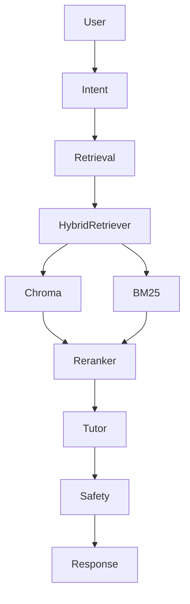
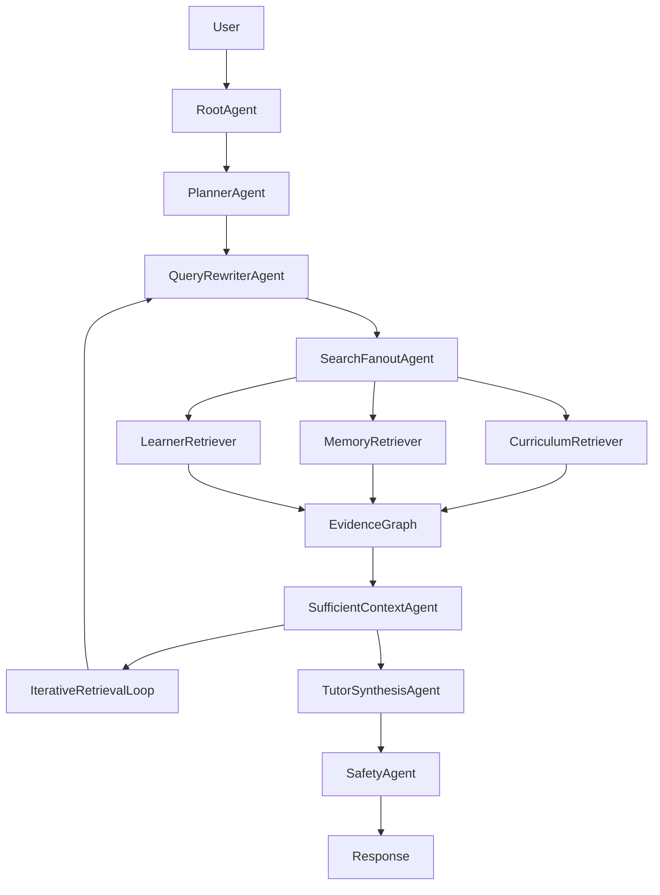
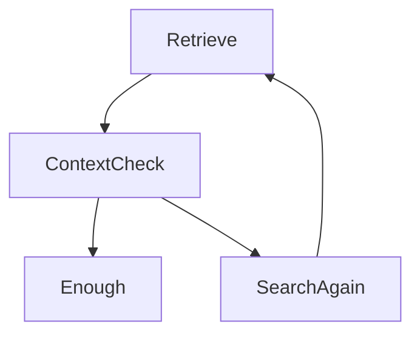

# PRD-001 — Google-Style Multi-Agent Agentic RAG Platform

## Project

EthioBio AI Assistant

## Initiative

Multi-Agent Agentic RAG Transformation

## Priority

CRITICAL

## Status

Architecture Design

## Type

Core Platform Upgrade

---

# 1. Executive Summary

EthioBio currently implements:

* Advanced Hybrid RAG
* Persistent Educational Memory
* Adaptive Learning Intelligence
* Socratic Tutoring
* LangGraph Workflow Orchestration

However, it does not yet implement Google's Agentic RAG architecture, whose defining capabilities are:

* Planning
* Query decomposition
* Query rewriting
* Search fanout
* Multi-corpus retrieval
* Sufficient-context verification
* Iterative retrieval loops
* Evidence-grounded synthesis

This initiative transforms EthioBio into a true Multi-Agent Agentic RAG platform while preserving its educational specialization.

---

# 2. Goals

## Primary Goal

Create a dependable educational reasoning system that:

* Finds evidence
* Determines whether evidence is sufficient
* Continues searching when evidence is incomplete
* Produces grounded educational responses

instead of:

```text
Retrieve Once
→ Generate
```

---

## Secondary Goals

### Improve Answer Quality

Reduce:

* hallucinations
* incomplete answers
* unsupported claims

---

### Improve Multi-Hop Reasoning

Enable:

```text
Question
↓
Multiple Retrieval Steps
↓
Evidence Collection
↓
Verified Answer
```

---

### Improve Personalization

Combine:

```text
Curriculum Knowledge
+
Student Memory
+
Learning Intelligence
```

inside retrieval planning.

---

# 3. Non-Goals

This phase will not include:

* Autonomous web browsing
* Autonomous curriculum editing
* Autonomous content creation
* Autonomous grading

Focus remains:

```text
Dependable Educational Retrieval
```

---

# 4. Current Architecture



---

# 5. Target Architecture



---

# 6. Core Design Principles

## Principle 1

Never answer from incomplete evidence.

---

## Principle 2

Always verify retrieval sufficiency.

---

## Principle 3

Search until stopping criteria are met.

---

## Principle 4

Maintain curriculum grounding.

---

## Principle 5

Personalization must influence retrieval.

---

# 7. Agent Architecture

## Agent 1

Root Agent

### Responsibility

Entry point.

Determines:

```text
Simple Question?
Complex Question?
Needs RAG?
Needs Iteration?
```

### Output

Execution strategy.

---

## Agent 2

Planner Agent

### Responsibility

Create retrieval plan.

Example:

Question:

```text
How does mitosis differ from meiosis and which one have I struggled with before?
```

Planner creates:

```text
Task 1
Retrieve mitosis information

Task 2
Retrieve meiosis information

Task 3
Retrieve learner history
```

---

## Agent 3

Query Rewriter Agent

### Responsibility

Transform question into retrieval queries.

Example:

```text
Original:
How does mitosis differ from meiosis?

Queries:

mitosis definition
meiosis definition
mitosis stages
meiosis stages
mitosis vs meiosis comparison
```

---

## Agent 4

Search Fanout Agent

### Responsibility

Dispatch queries across:

```text
Curriculum Corpus
Student Memory
Learning Intelligence
Future External Sources
```

---

## Agent 5

Retriever Agents

### Curriculum Retriever

Uses:

```text
Chroma
BM25
Reranker
```

---

### Memory Retriever

Uses:

```text
Cross Session Recall
Topic Recall
Misconceptions
```

---

### Learner Retriever

Uses:

```text
Snapshot Service
Recommendation Service
Readiness Service
```

---

# 8. Evidence Graph

New component.

## Purpose

Central evidence registry.

Stores:

```text
Query
Source
Chunk
Score
Reason
Agent
```

---

## Example

```text
Claim:
Photosynthesis requires chlorophyll

Evidence:
Grade 9 Biology Chapter 4

Confidence:
0.94
```

---

# 9. Sufficient Context Agent

## Purpose

Google's key innovation.

Determines:

```text
Do we have enough information?
```

---

## Inputs

### Original Question

### Retrieved Evidence

### Draft Answer

---

## Outputs

### SUFFICIENT

or

### INSUFFICIENT

---

## Example

Question:

```text
Explain meiosis and common student misconceptions.
```

Retrieved:

```text
Meiosis content
```

Missing:

```text
Misconception evidence
```

Output:

```text
INSUFFICIENT
```

Feedback:

```text
Retrieve misconception history.
```

---

# 10. Iterative Retrieval Loop

## Purpose

Continue retrieval until:

```text
Sufficient Context = TRUE
```

---

## Loop



---

## Stopping Criteria

Maximum:

```text
3 iterations
```

or

```text
Context Sufficiency ≥ 0.90
```

---

# 11. Tutor Synthesis Agent

## Responsibility

Generate final educational response.

Uses:

```text
Verified Evidence
Learner Profile
Socratic State
```

---

## Must Not

Generate unsupported claims.

---

# 12. Safety Agent

Existing component.

Expanded to verify:

### Safety

### Educational Compliance

### Evidence Attribution

---

# 13. Retrieval Strategy Framework

New capability.

Agent chooses:

| Scenario         | Strategy         |
| ---------------- | ---------------- |
| Fact Lookup      | Dense            |
| Exact Term       | BM25             |
| Concept Learning | Hybrid           |
| Personalization  | Memory           |
| Weak Recall      | Iterative Search |

---

# 14. Observability

Track:

### Query

### Rewritten Queries

### Retrieved Chunks

### Sufficiency Decisions

### Iterations

### Final Confidence

---

# 15. Evaluation Framework

Metrics:

## Retrieval

* Recall@K
* MRR
* nDCG

---

## Context Sufficiency

* Sufficiency Accuracy

---

## Generation

* Groundedness
* Faithfulness
* Hallucination Rate

---

## Education

* Learning Gain
* Misconception Resolution
* Personalization Accuracy

---

# 16. Success Metrics

## Retrieval

Target:

```text
Recall@10 > 90%
```

---

## Sufficiency

Target:

```text
Context Sufficiency Accuracy > 85%
```

---

## Hallucinations

Reduce by:

```text
50%
```

---

## Educational Quality

Increase grounded responses by:

```text
30%
```

---

# 17. Migration Strategy

## Phase 1

Agentic Foundation

Introduce:

* Planner Agent
* Query Rewriter Agent

---

## Phase 2

Retrieval Expansion

Introduce:

* Search Fanout Agent
* Evidence Graph

---

## Phase 3

Dependability Layer

Introduce:

* Sufficient Context Agent
* Iterative Retrieval Loop

---

## Phase 4

Educational Integration

Integrate:

* Memory Retrieval
* Learner Retrieval
* Recommendation Engine

---

## Phase 5

Evaluation & Observability

Introduce:

* Metrics
* Tracing
* Quality dashboards

---

# Recommended Next PRDs

1. PRD-002 — Planner Agent
2. PRD-003 — Query Rewriter Agent
3. PRD-004 — Search Fanout Agent
4. PRD-005 — Evidence Graph
5. PRD-006 — Sufficient Context Agent
6. PRD-007 — Iterative Retrieval Loop
7. PRD-008 — Tutor Synthesis Agent
8. PRD-009 — Agent Observability & Evaluation

These should be written as implementation-ready PRDs that can be directly executed through Ralph Loop/Codex with concrete interfaces, LangGraph nodes, state schemas, prompts, evaluation criteria, and migration steps.
