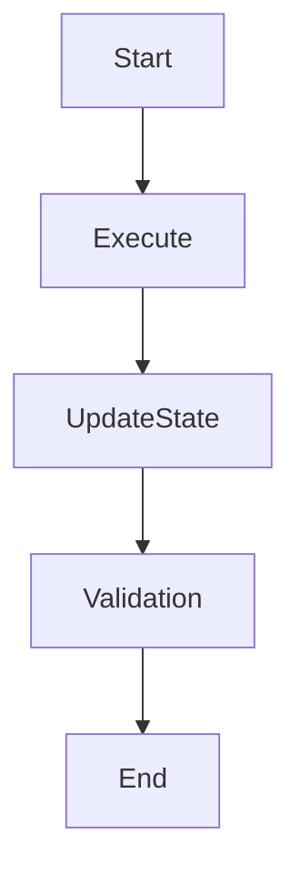
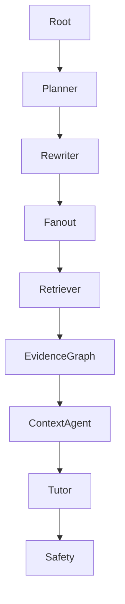
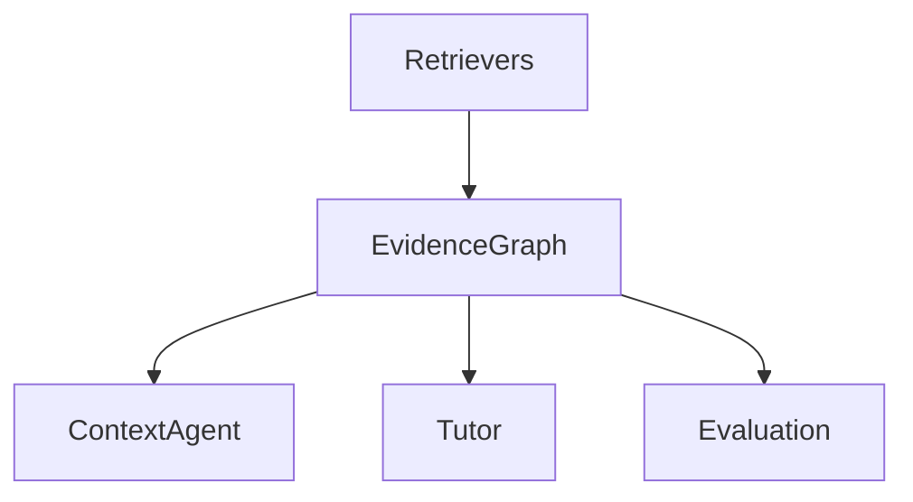
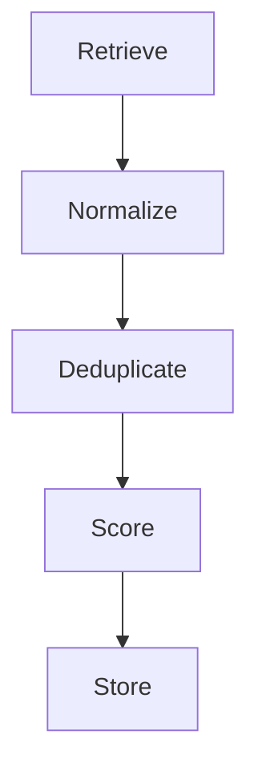

Excellent. The next step is to establish the architectural contracts before any agent implementation begins.

These two PRDs become the foundation for every future agent, LangGraph node, evaluation framework, and memory integration.

---

# PRD-001A — Agent Runtime & Shared State Specification

## Project

EthioBio AI Assistant

## Initiative

Multi-Agent Agentic RAG Transformation

## Status

Architecture Foundation

## Priority

CRITICAL

## Type

Platform Infrastructure

---

# 1. Purpose

Define a standardized runtime architecture for all Agentic RAG agents.

This PRD establishes:

* Shared State
* Agent Interfaces
* Agent Lifecycle
* LangGraph Contracts
* Agent Ownership Rules
* State Mutation Rules

Without this specification, individual agents may become tightly coupled and difficult to scale.

---

# 2. Problem Statement

Current EthioBio workflows primarily operate through procedural orchestration:

```text
User
↓
Retriever
↓
Tutor
↓
Safety
```

The target architecture introduces multiple agents:

```text
Root
↓
Planner
↓
Query Rewriter
↓
Fanout
↓
Context Agent
↓
Tutor
```

These agents require:

* shared context
* deterministic communication
* state ownership
* execution traceability

---

# 3. Architectural Principles

## Principle 1

Agents communicate only through state.

Never:

```python
planner.call(context_agent)
```

Always:

```python
planner → state
context_agent ← state
```

---

## Principle 2

Single owner per state field.

Avoid:

```python
planner modifies evidence
fanout modifies evidence
retriever modifies evidence
```

---

## Principle 3

Agents are stateless.

Persistent information belongs in:

```text
Memory Layer
Evidence Graph
Learner Profile Store
```

---

## Principle 4

Every agent must be independently testable.

---

# 4. Agent Runtime Model

## Agent Definition

```python
class Agent:

    name: str

    description: str

    def execute(
        self,
        state: AgenticRAGState
    ) -> AgenticRAGState:
        ...
```

---

# 5. Shared State Schema

Create:

```python
AgenticRAGState
```

Location:

```text
src/graphs/state/agentic_rag_state.py
```

---

## Core Query State

```python
user_query: str

query_type: str

complexity_score: float
```

---

## Planning State

```python
execution_plan: Plan

subtasks: list[SubTask]
```

Owner:

```text
Planner Agent
```

---

## Query State

```python
rewritten_queries: list[str]

query_intents: list[str]
```

Owner:

```text
Query Rewriter Agent
```

---

## Retrieval State

```python
retrieval_tasks: list[RetrievalTask]

retrieval_iterations: int
```

Owner:

```text
Search Fanout Agent
```

---

## Evidence State

```python
evidence_ids: list[str]

evidence_summary: str

coverage_score: float
```

Owner:

```text
Evidence Graph
```

---

## Context Sufficiency

```python
sufficiency_score: float

sufficiency_reason: str

missing_information: list[str]

requires_iteration: bool
```

Owner:

```text
Sufficient Context Agent
```

---

## Learner State

```python
learner_snapshot: dict

learning_recommendations: list

misconceptions: list

readiness_score: float
```

Owner:

```text
Learning Intelligence Layer
```

Read-only to agents.

---

## Final Generation

```python
response_draft: str

grounded_response: str
```

Owner:

```text
Tutor Synthesis Agent
```

---

# 6. State Ownership Matrix

| State Field       | Owner                 |
| ----------------- | --------------------- |
| user_query        | Root                  |
| execution_plan    | Planner               |
| rewritten_queries | Rewriter              |
| retrieval_tasks   | Fanout                |
| evidence_ids      | Evidence Graph        |
| sufficiency_score | Context Agent         |
| learner_snapshot  | Learning Intelligence |
| grounded_response | Tutor                 |

---

# 7. Agent Lifecycle



---

# 8. LangGraph Execution Model



---

# 9. Error Handling

All agents return:

```python
AgentResult
```

Schema:

```python
success: bool

message: str

state_updates: dict

errors: list
```

---

# 10. Acceptance Criteria

### Must Have

* Shared state schema
* Ownership enforcement
* Typed contracts
* LangGraph integration

### Success

Every future agent can be added without changing existing interfaces.

---

# PRD-001B — Evidence Graph Specification

## Project

EthioBio AI Assistant

## Initiative

Dependable Agentic Retrieval

## Priority

CRITICAL

---

# 1. Purpose

Create a centralized evidence management layer.

This becomes the backbone of:

```text
Planner
Retriever
Context Agent
Tutor
Evaluation
```

---

# 2. Problem Statement

Current retrieval returns:

```python
chunks
```

and immediately generates:

```python
response
```

There is no persistent representation of evidence.

Google's Agentic RAG depends on evidence inspection and sufficiency analysis.

---

# 3. Evidence Graph Goals

Enable:

### Provenance

```text
Where did evidence come from?
```

---

### Coverage

```text
What parts of the question are answered?
```

---

### Gap Detection

```text
What information is missing?
```

---

### Iterative Retrieval

```text
What should be searched next?
```

---

# 4. Architecture



---

# 5. Evidence Schema

Location:

```text
src/core/evidence/models.py
```

---

## Evidence

```python
class Evidence:

    id: str

    source_type: str

    source_name: str

    chunk_id: str

    content: str

    query: str

    retrieval_score: float

    rerank_score: float

    confidence: float

    retrieved_by: str
```

---

# 6. Evidence Collection Pipeline



---

# 7. Evidence Coverage Model

Create:

```python
CoverageAnalysis
```

---

Tracks:

```python
question_component

covered

confidence

supporting_evidence
```

---

Example:

Question:

```text
Compare mitosis and meiosis and explain common misconceptions.
```

Coverage:

| Component      | Covered |
| -------------- | ------- |
| Mitosis        | Yes     |
| Meiosis        | Yes     |
| Misconceptions | No      |

---

# 8. Missing Information Detection

Output:

```python
MissingInformation
```

Example:

```python
[
  "misconceptions",
  "student history"
]
```

This becomes input to:

```text
Sufficient Context Agent
```

---

# 9. Evidence Confidence Model

Confidence computed from:

```text
Retrieval Score
Rerank Score
Source Quality
Chunk Consistency
```

Range:

```python
0.0 → 1.0
```

---

# 10. Evidence Summarization

Generate:

```python
EvidenceSummary
```

Used by:

```text
Tutor Agent
Context Agent
Evaluation Layer
```

---

# 11. Integration Points

### Planner

Consumes:

```text
Coverage Reports
```

---

### Context Agent

Consumes:

```text
Evidence Coverage
Missing Information
```

---

### Tutor

Consumes:

```text
Verified Evidence
```

---

### Evaluation

Consumes:

```text
Evidence Provenance
```

---

# 12. Future Extensions

Support:

```text
Web Retrieval
Image Retrieval
Diagram Retrieval
Assessment Retrieval
```

without changing the graph structure.

---

# 13. Acceptance Criteria

### Functional

* Evidence registry exists
* Deduplication works
* Provenance tracking works
* Coverage tracking works
* Missing information detection works

### Success Metric

The system can explicitly answer:

```text
What evidence supports this answer?
```

and

```text
What evidence is still missing?
```

before generating a response.

---

With PRD-001A and PRD-001B established, the architecture is now stable enough to proceed with **PRD-002 (Planner Agent)**, **PRD-003 (Query Rewriter Agent)**, and **PRD-004 (Search Fanout Agent)** as implementation-ready components rather than isolated features. These next three PRDs form the complete retrieval-planning layer of the Agentic RAG system.
