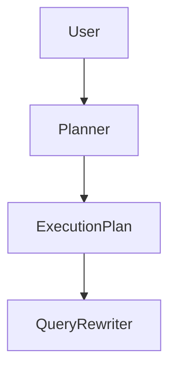
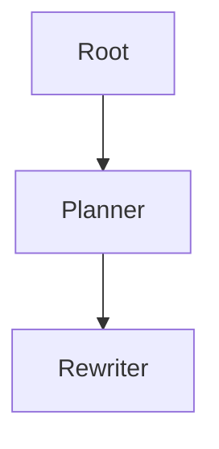

Good approach. These should be produced individually because each becomes a separate implementation target in Ralph Loop.

The correct order is:

```text
PRD-002 Planner Agent
PRD-003 Query Rewriter Agent
PRD-004 Search Fanout Agent
PRD-005 Evidence Graph
PRD-006 Sufficient Context Agent
PRD-007 Iterative Retrieval Loop
PRD-008 Tutor Synthesis Agent
PRD-009 Observability & Evaluation
```

Let's start with the most important component.

---

# PRD-002 — Planner Agent

## Project

EthioBio AI Assistant

## Initiative

Google-Style Multi-Agent Agentic RAG

## Component

Planner Agent

## Priority

CRITICAL

## Status

Planned

## Type

Core Agent

---

# 1. Executive Summary

The Planner Agent is the first reasoning component in the Agentic RAG workflow.

Its responsibility is to transform a user question into an explicit retrieval and reasoning plan.

Instead of directly retrieving information:

```text
Question
↓
Retriever
```

the system becomes:

```text
Question
↓
Planner
↓
Retrieval Plan
↓
Retriever
```

This aligns with Google's Agentic RAG architecture where the Planner determines information pathways before retrieval begins.

---

# 2. Problem Statement

Current EthioBio behavior:

```text
User Query
↓
Intent Classification
↓
Retrieval
```

Problems:

### No decomposition

Question:

```text
How does meiosis differ from mitosis and which topic have I struggled with most?
```

Current system performs:

```text
One Retrieval
```

but actually requires:

```text
Task 1
Retrieve mitosis

Task 2
Retrieve meiosis

Task 3
Retrieve learner history

Task 4
Compare results
```

---

# 3. Goals

## Primary Goal

Convert a question into a structured execution plan.

---

## Secondary Goals

Support:

* Multi-hop reasoning
* Personalized retrieval
* Cross-memory retrieval
* Iterative search

---

# 4. Non-Goals

Planner will NOT:

* Retrieve documents
* Rewrite queries
* Generate answers
* Evaluate sufficiency

Those belong to other agents.

---

# 5. Agent Responsibilities

The Planner Agent must:

### Analyze Query

Determine:

```python
complexity
intent
domain
learning_goal
```

---

### Identify Required Information

Example:

Question:

```text
Compare mitosis and meiosis and explain my misconceptions.
```

Planner outputs:

```python
[
    "retrieve_mitosis",
    "retrieve_meiosis",
    "retrieve_misconceptions"
]
```

---

### Create Retrieval Strategy

Determine:

```python
curriculum_required
memory_required
learner_profile_required
```

---

### Create Subtasks

Example:

```python
[
    SubTask(
        type="curriculum",
        topic="mitosis"
    ),

    SubTask(
        type="curriculum",
        topic="meiosis"
    ),

    SubTask(
        type="memory",
        topic="cell division"
    )
]
```

---

# 6. Architecture



---

# 7. Planner State Contract

Input:

```python
state.user_query

state.learner_snapshot
```

Output:

```python
state.execution_plan

state.subtasks
```

---

# 8. Plan Schema

Location:

```text
src/agents/planner/models.py
```

---

## Plan

```python
class Plan:

    objective: str

    complexity_score: float

    retrieval_domains: list[str]

    subtasks: list[SubTask]

    reasoning_type: str

    estimated_iterations: int
```

---

## SubTask

```python
class SubTask:

    id: str

    type: str

    objective: str

    target_source: str

    priority: int
```

---

# 9. Complexity Classification

The Planner must classify:

## Simple

Example:

```text
What is photosynthesis?
```

Output:

```python
complexity = LOW
```

---

## Moderate

Example:

```text
Explain photosynthesis and respiration.
```

Output:

```python
complexity = MEDIUM
```

---

## Complex

Example:

```text
Compare photosynthesis and respiration,
identify my misconceptions,
and recommend a study strategy.
```

Output:

```python
complexity = HIGH
```

---

# 10. Reasoning Types

Planner predicts reasoning type.

Options:

```python
FACT_LOOKUP

EXPLANATION

COMPARISON

MULTI_HOP

PERSONALIZED

SOCRATIC

REMEDIATION
```

---

Example:

```text
Compare mitosis and meiosis
```

returns:

```python
COMPARISON
```

---

# 11. Retrieval Domain Selection

Planner decides:

| Domain          | Use Case            |
| --------------- | ------------------- |
| curriculum      | textbook content    |
| memory          | past interactions   |
| learner_profile | readiness           |
| misconceptions  | learning weaknesses |
| recommendations | study planning      |

---

Example:

Question:

```text
Why do I keep confusing mitosis and meiosis?
```

Output:

```python
domains = [
    curriculum,
    misconceptions,
    memory
]
```

---

# 12. Personalization Planning

Planner must detect:

```text
my
I
previously
before
struggled
weakness
```

If detected:

Automatically include:

```python
memory_retrieval = True
```

---

# 13. LangGraph Integration

Node:

```python
PlannerNode
```

Location:

```text
src/graphs/nodes/planner.py
```

---

Flow:



---

# 14. Prompt Design

System Prompt:

```text
You are the Planner Agent.

Your responsibility is to:

1. Understand the user's objective.
2. Break the request into retrieval tasks.
3. Determine which knowledge sources are required.
4. Estimate complexity.
5. Produce a structured plan.

Do not answer the question.
Do not retrieve documents.
Only produce a plan.
```

---

# 15. Failure Handling

If planning fails:

Fallback:

```python
Plan(
    complexity="LOW",
    domains=["curriculum"]
)
```

---

# 16. Evaluation

Metrics:

### Plan Accuracy

Correct subtasks generated.

---

### Domain Accuracy

Correct sources selected.

---

### Complexity Accuracy

Correct complexity classification.

---

### Retrieval Efficiency

Reduction in unnecessary retrievals.

---

# 17. Success Criteria

### Functional

Planner can:

* Create plans
* Create subtasks
* Select domains
* Classify complexity

---

### Performance

Target:

```text
Plan generation < 1 second
```

---

### Quality

Target:

```text
Task Coverage Accuracy > 90%
```

---

# 18. Deliverables

## New Files

```text
src/agents/planner/
├── planner.py
├── prompts.py
├── models.py
└── evaluator.py
```

## Graph Node

```text
src/graphs/nodes/planner.py
```

## Tests

```text
tests/agents/test_planner.py
```

---

This PRD is implementation-ready and should be completed before PRD-003 (Query Rewriter Agent), since the Query Rewriter will consume the Planner's execution plan and subtasks.
