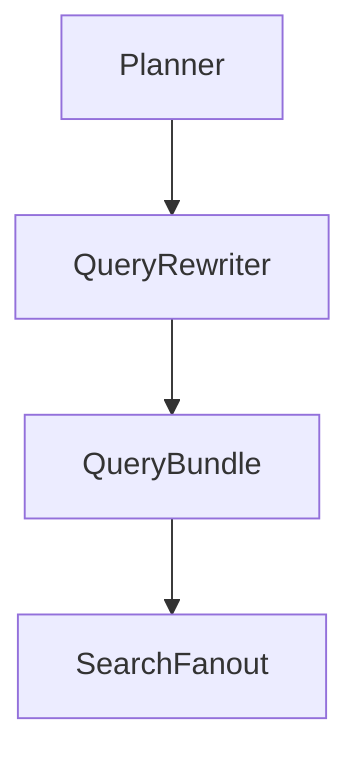
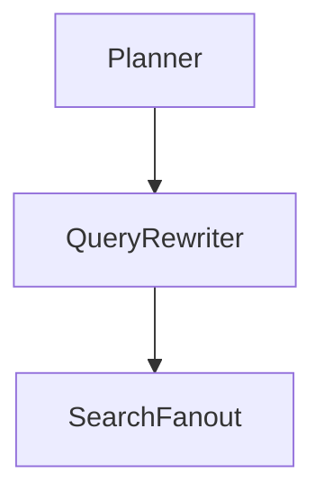

# PRD-003 — Query Rewriter Agent

## Project

EthioBio AI Assistant

## Initiative

Google-Style Multi-Agent Agentic RAG

## Component

Query Rewriter Agent

## Priority

CRITICAL

## Status

Planned

## Type

Core Agent

---

# 1. Executive Summary

The Query Rewriter Agent transforms a high-level user request and Planner-generated subtasks into optimized retrieval queries.

This agent is responsible for converting:

```text
User Question
```

into:

```text
Multiple Retrieval-Oriented Queries
```

aligned with:

* Vector retrieval
* BM25 retrieval
* Memory retrieval
* Learner-profile retrieval
* Misconception retrieval

This follows Google's Agentic RAG architecture where the Query Rewriter bridges planning and retrieval.

---

# 2. Problem Statement

Current EthioBio retrieval primarily uses:

```text
User Query
↓
Retriever
```

This works well for:

```text
What is photosynthesis?
```

but performs poorly for:

```text
Why do I keep confusing mitosis and meiosis,
and what study strategy should I follow?
```

because retrieval needs multiple targeted searches:

```text
mitosis definition

meiosis definition

mitosis vs meiosis

student misconceptions

past learner mistakes

recommended study strategies
```

The current system does not systematically generate these retrieval-oriented queries.

---

# 3. Goals

## Primary Goal

Convert execution plans into retrieval-ready query bundles.

---

## Secondary Goals

Improve:

* Retrieval recall
* Coverage
* Multi-hop retrieval
* Personalization retrieval
* Evidence completeness

---

# 4. Non-Goals

The Query Rewriter does NOT:

* Retrieve documents
* Select retrievers
* Evaluate sufficiency
* Generate answers

Those belong to other agents.

---

# 5. Agent Responsibilities

The Query Rewriter must:

### Read Plan

Consume:

```python
execution_plan
subtasks
```

---

### Generate Search Queries

Produce:

```python
rewritten_queries
```

---

### Expand Concepts

Example:

Input:

```text
Explain meiosis
```

Output:

```text
meiosis definition

meiosis stages

purpose of meiosis

genetic variation in meiosis
```

---

### Generate Retrieval Variants

Create:

```text
semantic query

keyword query

comparison query

educational query
```

when appropriate.

---

### Generate Personalized Queries

Example:

Input:

```text
Why do I struggle with meiosis?
```

Output:

```text
student misconceptions meiosis

learner history meiosis

previous meiosis mistakes

meiosis remediation recommendations
```

---

# 6. Architecture



---

# 7. State Contract

Input:

```python
state.execution_plan

state.subtasks

state.user_query
```

Output:

```python
state.rewritten_queries

state.query_groups
```

---

# 8. Query Bundle Schema

Location:

```text
src/agents/query_rewriter/models.py
```

---

## QueryBundle

```python
class QueryBundle:

    original_query: str

    rewritten_queries: list[RewrittenQuery]

    estimated_coverage: float
```

---

## RewrittenQuery

```python
class RewrittenQuery:

    query: str

    source_type: str

    purpose: str

    priority: int
```

---

# 9. Query Categories

Every generated query must belong to one of:

```python
CURRICULUM

MEMORY

MISCONCEPTION

LEARNER_PROFILE

RECOMMENDATION

COMPARISON

DEFINITION
```

---

# 10. Query Expansion Rules

## Rule 1

Definitions expand into:

```text
definition

key concepts

examples
```

---

Example:

```text
What is osmosis?
```

Produces:

```text
osmosis definition

examples of osmosis

importance of osmosis
```

---

## Rule 2

Comparison expands into:

```text
concept A

concept B

differences

similarities
```

---

Example:

```text
mitosis vs meiosis
```

Produces:

```text
mitosis definition

meiosis definition

mitosis stages

meiosis stages

differences between mitosis and meiosis

similarities between mitosis and meiosis
```

---

## Rule 3

Personalized questions expand memory retrieval.

Input:

```text
Why do I struggle with genetics?
```

Produces:

```text
genetics misconceptions

genetics learner history

previous genetics questions

genetics readiness
```

---

# 11. Source-Aware Rewriting

The Query Rewriter must generate different queries for different sources.

---

## Curriculum Retrieval

Example:

```text
photosynthesis light dependent reactions
```

---

## Memory Retrieval

Example:

```text
learner mistakes photosynthesis
```

---

## Recommendation Retrieval

Example:

```text
recommended study strategy photosynthesis
```

---

# 12. Query Quality Rules

All queries must:

### Be Atomic

Good:

```text
meiosis stages
```

Bad:

```text
Explain all details about meiosis and compare it with mitosis and tell me what I got wrong
```

---

### Be Search-Oriented

Good:

```text
cell division misconceptions
```

Bad:

```text
Could you please tell me why students usually make mistakes?
```

---

### Be Source-Specific

Each query should target a retrieval domain.

---

# 13. Coverage Estimation

The agent must estimate:

```python
coverage_score
```

Example:

Question:

```text
Compare mitosis and meiosis and explain my misconceptions.
```

Coverage:

```python
mitosis = covered

meiosis = covered

comparison = covered

misconceptions = covered

coverage = 1.0
```

---

# 14. Prompt Design

System Prompt:

```text
You are the Query Rewriter Agent.

Your responsibility is to transform
a retrieval plan into optimized
search queries.

Create focused, atomic,
retrieval-oriented queries.

Do not answer the question.

Do not retrieve documents.

Only generate search queries.
```

---

# 15. LangGraph Integration

Node:

```python
QueryRewriterNode
```

Location:

```text
src/graphs/nodes/query_rewriter.py
```

---

Flow:



---

# 16. Failure Handling

Fallback:

```python
rewritten_queries = [
    user_query
]
```

This ensures retrieval can continue even if rewriting fails.

---

# 17. Evaluation

Metrics:

## Query Quality

Human evaluation.

---

## Coverage Accuracy

Measures whether all task components are represented.

---

## Retrieval Recall Improvement

Compare:

```text
Raw Query Retrieval
```

vs

```text
Rewritten Query Retrieval
```

---

## Redundancy Rate

Measure duplicate queries.

Target:

```text
<10%
```

---

# 18. Success Criteria

### Functional

Must:

* Generate query bundles
* Expand complex questions
* Create source-aware queries
* Support personalization

---

### Performance

Target:

```text
<1 second
```

per query bundle generation.

---

### Quality

Target:

```text
Coverage Accuracy > 90%
```

---

### Retrieval Improvement

Target:

```text
Recall Improvement > 20%
```

compared to raw-query retrieval.

---

# 19. Deliverables

## New Files

```text
src/agents/query_rewriter/

├── query_rewriter.py
├── prompts.py
├── models.py
├── evaluator.py
```

---

## Graph Node

```text
src/graphs/nodes/query_rewriter.py
```

---

## Tests

```text
tests/agents/test_query_rewriter.py
```

---

# Dependencies

Requires:

```text
PRD-001A Agent Runtime
PRD-001B Evidence Graph Foundation
PRD-002 Planner Agent
```

---

# Outputs To Next Agent

Produces:

```python
rewritten_queries

query_groups

coverage_score
```

which become inputs for:

> **PRD-004 — Search Fanout Agent**

The Search Fanout Agent will use these rewritten queries to determine which retrieval systems (curriculum, memory, learner profile, recommendations, future web retrieval) should be executed and in what order.
