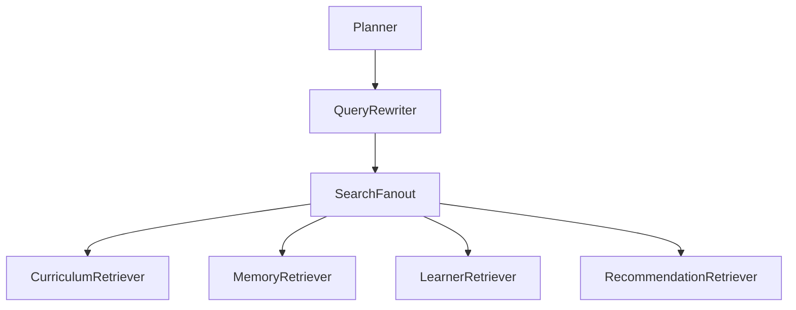
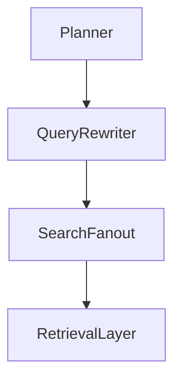

# PRD-004 — Search Fanout Agent

## Project

EthioBio AI Assistant

## Initiative

Google-Style Multi-Agent Agentic RAG

## Component

Search Fanout Agent

## Priority

CRITICAL

## Status

Planned

## Type

Core Agent

---

# 1. Executive Summary

The Search Fanout Agent is responsible for transforming rewritten queries into executable retrieval operations across multiple knowledge sources.

This agent acts as the routing and orchestration layer between:

```text
Query Rewriter
```

and

```text
Retrieval Systems
```

Instead of sending all queries to every retriever, the Search Fanout Agent intelligently decides:

* Which retrieval source should be queried
* Which queries belong to which source
* Retrieval priority
* Retrieval concurrency
* Retrieval budget allocation

This is the first true multi-agent retrieval orchestration component and aligns closely with Google's Search Fanout pattern.

---

# 2. Problem Statement

Current EthioBio retrieval behaves approximately as:

```text
Query
↓
Hybrid Retriever
↓
Results
```

While effective for simple retrieval, it lacks:

### Source Selection

Cannot determine:

```text
Curriculum?
Memory?
Learner Profile?
Recommendations?
```

---

### Retrieval Planning

Cannot decide:

```text
What should be searched first?
```

---

### Parallel Search

Cannot efficiently coordinate:

```text
Many Queries
Many Sources
```

---

### Retrieval Budgeting

Cannot prevent:

```text
Expensive unnecessary searches
```

---

# 3. Goals

## Primary Goal

Route rewritten queries to the optimal retrieval systems.

---

## Secondary Goals

Improve:

* Retrieval efficiency
* Retrieval coverage
* Multi-source retrieval
* Personalization retrieval
* Future scalability

---

# 4. Non-Goals

The Fanout Agent does NOT:

* Generate queries
* Retrieve documents
* Evaluate sufficiency
* Generate answers

Those belong to other components.

---

# 5. Agent Responsibilities

The Search Fanout Agent must:

### Read Query Bundles

Consume:

```python
rewritten_queries
query_groups
```

---

### Select Retrieval Sources

Determine:

```python
target_retriever
```

for every query.

---

### Create Retrieval Tasks

Generate:

```python
RetrievalTask
```

objects.

---

### Prioritize Searches

Determine:

```python
priority
```

for each task.

---

### Schedule Searches

Support:

```python
parallel_execution
```

where possible.

---

### Allocate Retrieval Budget

Limit:

```python
iterations
retrieval volume
latency
```

---

# 6. Architecture



---

# 7. State Contract

Input:

```python
state.rewritten_queries

state.query_groups

state.execution_plan
```

Output:

```python
state.retrieval_tasks

state.retrieval_strategy
```

---

# 8. Retrieval Task Schema

Location:

```text
src/agents/search_fanout/models.py
```

---

## RetrievalTask

```python
class RetrievalTask:

    id: str

    query: str

    target_source: str

    priority: int

    estimated_cost: float

    reasoning: str
```

---

## RetrievalStrategy

```python
class RetrievalStrategy:

    strategy_name: str

    retrieval_mode: str

    parallel_execution: bool

    expected_sources: list[str]
```

---

# 9. Supported Retrieval Sources

## Curriculum Retriever

Purpose:

```text
Knowledge Base Retrieval
```

Current Sources:

```text
Chroma
BM25
Hybrid Search
```

---

## Memory Retriever

Purpose:

```text
Cross Session Recall
```

Current Sources:

```text
Topic Recall
Session Recall
Misconceptions
```

---

## Learner Retriever

Purpose:

```text
Student State Retrieval
```

Current Sources:

```text
Learner Snapshot
Readiness
Progress
```

---

## Recommendation Retriever

Purpose:

```text
Learning Recommendations
```

Current Sources:

```text
Recommendation Service
Adaptive Strategies
```

---

## Future Sources

Must support:

```text
Web Retrieval

Image Retrieval

Diagram Retrieval

Assessment Retrieval

Research Retrieval
```

without redesign.

---

# 10. Source Routing Rules

## Curriculum Queries

Example:

```text
meiosis stages
```

Route:

```python
CurriculumRetriever
```

---

## Memory Queries

Example:

```text
previous mistakes meiosis
```

Route:

```python
MemoryRetriever
```

---

## Learner Queries

Example:

```text
student readiness meiosis
```

Route:

```python
LearnerRetriever
```

---

## Recommendation Queries

Example:

```text
best study strategy meiosis
```

Route:

```python
RecommendationRetriever
```

---

# 11. Priority Rules

Every task receives:

```python
priority
```

Range:

```python
1-10
```

---

## High Priority

Examples:

```text
Core concepts

Required definitions

Direct question components
```

Priority:

```python
10
```

---

## Medium Priority

Examples:

```text
Examples

Supplementary explanations
```

Priority:

```python
5
```

---

## Low Priority

Examples:

```text
Optional enrichment
```

Priority:

```python
1
```

---

# 12. Retrieval Strategies

## SIMPLE

Single-source retrieval.

Example:

```text
What is osmosis?
```

Strategy:

```python
Curriculum Only
```

---

## COMPARISON

Example:

```text
Mitosis vs Meiosis
```

Strategy:

```python
Multiple Curriculum Queries
```

---

## PERSONALIZED

Example:

```text
Why do I struggle with meiosis?
```

Strategy:

```python
Curriculum
+
Memory
+
Learner
```

---

## REMEDIATION

Example:

```text
How can I improve genetics?
```

Strategy:

```python
Memory
+
Recommendations
+
Learner
```

---

## MULTI-HOP

Example:

```text
Compare mitosis and meiosis,
explain my misconceptions,
and recommend study strategies.
```

Strategy:

```python
All Sources
```

---

# 13. Parallel Retrieval

The Fanout Agent should support:

```python
async retrieval
```

---

Example:

```text
Curriculum Retrieval
Memory Retrieval
Learner Retrieval
```

run simultaneously.

---

Benefits:

* Reduced latency
* Better scalability
* Improved user experience

---

# 14. Retrieval Budgeting

Fanout must limit:

### Query Count

Default:

```python
max_queries = 20
```

---

### Source Count

Default:

```python
max_sources = 4
```

---

### Retrieval Cost

Prevent runaway retrieval loops.

---

# 15. Failure Handling

If a source fails:

Continue with remaining sources.

Example:

```text
Memory Retrieval Failed
```

Still execute:

```text
Curriculum
Learner
Recommendations
```

---

# 16. LangGraph Integration

Node:

```python
SearchFanoutNode
```

Location:

```text
src/graphs/nodes/search_fanout.py
```

---

Flow:



---

# 17. Prompt Design

System Prompt:

```text
You are the Search Fanout Agent.

Your responsibility is to:

1. Route queries to the correct retrieval sources.
2. Prioritize retrieval tasks.
3. Allocate retrieval budget.
4. Optimize retrieval efficiency.

Do not retrieve documents.

Do not answer questions.

Only create retrieval tasks.
```

---

# 18. Evaluation

## Routing Accuracy

Correct retriever selected.

Target:

```text
>95%
```

---

## Retrieval Coverage

Required sources selected.

Target:

```text
>90%
```

---

## Parallelization Rate

Measure:

```text
tasks executed concurrently
```

---

## Latency Reduction

Compare:

```text
Sequential Retrieval
```

vs

```text
Fanout Retrieval
```

Target:

```text
30% faster
```

---

# 19. Success Criteria

### Functional

Must:

* Create retrieval tasks
* Route correctly
* Prioritize searches
* Support parallel execution

---

### Quality

Target:

```text
Routing Accuracy >95%
```

---

### Performance

Target:

```text
Fanout Generation <500ms
```

---

# 20. Deliverables

## New Files

```text
src/agents/search_fanout/

├── search_fanout.py
├── prompts.py
├── models.py
├── routing.py
├── evaluator.py
```

---

## Graph Node

```text
src/graphs/nodes/search_fanout.py
```

---

## Tests

```text
tests/agents/test_search_fanout.py
```

---

# Dependencies

Requires:

```text
PRD-001A Agent Runtime
PRD-001B Evidence Graph Foundation
PRD-002 Planner Agent
PRD-003 Query Rewriter Agent
```

---

# Outputs To Next Component

Produces:

```python
retrieval_tasks

retrieval_strategy

priority_routing

source_selection
```

These become inputs to the retrieval execution layer and feed directly into **PRD-005 — Evidence Graph**, which will aggregate, normalize, deduplicate, score, and organize all retrieved evidence before it reaches the Sufficient Context Agent.
