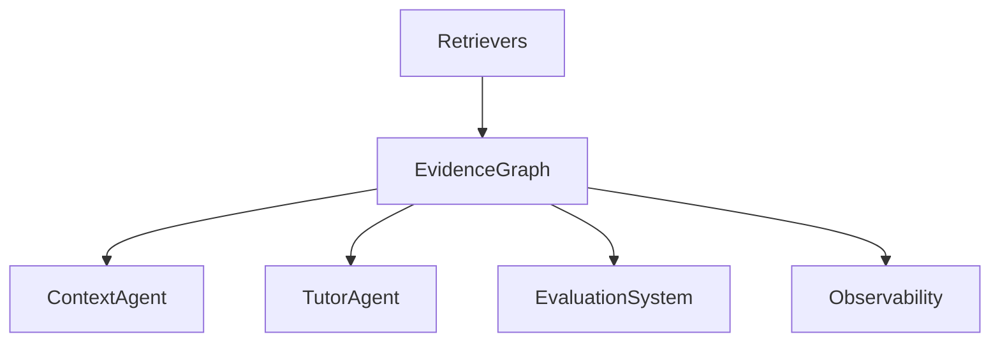
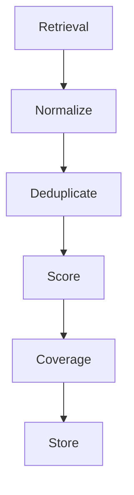
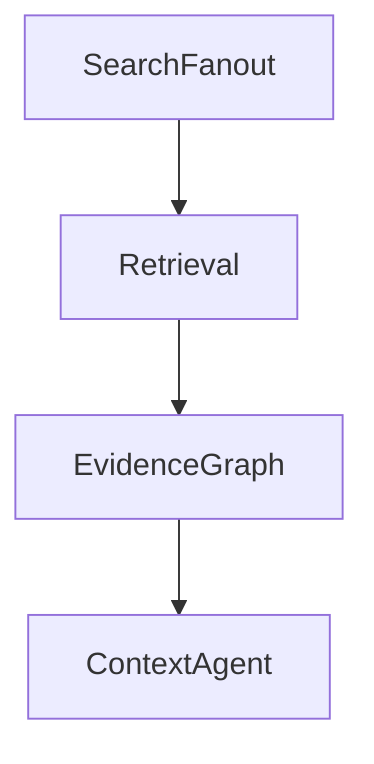

# PRD-005 — Evidence Graph

## Project

EthioBio AI Assistant

## Initiative

Google-Style Multi-Agent Agentic RAG

## Component

Evidence Graph

## Priority

CRITICAL

## Status

Planned

## Type

Core Infrastructure

---

# 1. Executive Summary

The Evidence Graph is the central knowledge coordination layer of the Agentic RAG architecture.

It transforms retrieval outputs from isolated document chunks into structured, traceable, verifiable evidence.

Instead of:

```text
Retriever
↓
LLM
```

the architecture becomes:

```text
Retriever
↓
Evidence Graph
↓
Context Verification
↓
Tutor Synthesis
```

This component enables:

* Evidence grounding
* Source attribution
* Coverage analysis
* Missing information detection
* Context sufficiency verification
* Iterative retrieval loops

The Evidence Graph is the foundation required for Google's "Sufficient Context" mechanism.

---

# 2. Problem Statement

Current retrieval systems return:

```python
List[Document]
```

with limited understanding of:

* Which parts answer the question
* Which evidence is duplicated
* Which evidence is missing
* Whether enough evidence exists

Current flow:

```text
Retrieve
↓
Generate
```

Target flow:

```text
Retrieve
↓
Evidence Analysis
↓
Coverage Analysis
↓
Context Verification
↓
Generate
```

---

# 3. Goals

## Primary Goal

Create a centralized evidence management layer.

---

## Secondary Goals

Enable:

* Evidence provenance
* Evidence deduplication
* Coverage tracking
* Missing information detection
* Agent collaboration
* Future verification systems

---

# 4. Non-Goals

The Evidence Graph does NOT:

* Retrieve documents
* Generate plans
* Rewrite queries
* Generate responses

Those belong to other agents.

---

# 5. Architecture



---

# 6. Core Responsibilities

The Evidence Graph must:

### Collect Evidence

Aggregate retrieval results.

---

### Normalize Evidence

Convert all retriever outputs into a common format.

---

### Deduplicate Evidence

Remove:

```text
Same Chunk
Same Source
Near Duplicates
```

---

### Score Evidence

Assign confidence.

---

### Analyze Coverage

Determine:

```text
What is answered?
What is unanswered?
```

---

### Build Evidence Relationships

Track:

```text
Question Component
↓
Supporting Evidence
```

---

# 7. Evidence Model

Location:

```text
src/core/evidence/models.py
```

---

## Evidence

```python
class Evidence:

    id: str

    content: str

    source_type: str

    source_name: str

    chunk_id: str

    query: str

    retrieval_score: float

    rerank_score: float

    confidence_score: float

    retrieved_by: str

    metadata: dict
```

---

## EvidenceCollection

```python
class EvidenceCollection:

    evidence_items: list[Evidence]

    summary: str

    coverage_score: float

    confidence_score: float
```

---

# 8. Evidence Sources

Supported sources:

## Curriculum

```text
Chroma
BM25
Hybrid Search
```

---

## Memory

```text
Cross Session Recall
Topic Recall
Misconceptions
```

---

## Learner Intelligence

```text
Readiness
Progress
Recommendations
```

---

## Future

```text
Web Search
Images
Research Papers
Assessments
```

---

# 9. Evidence Ingestion Pipeline



---

# 10. Evidence Normalization

Every retriever must output:

```python
Evidence
```

regardless of source.

---

Example:

Curriculum result:

```python
{
    "text": "...",
    "score": 0.91
}
```

becomes:

```python
Evidence(...)
```

---

# 11. Deduplication Engine

Purpose:

Prevent:

```text
Same concept
retrieved multiple times
```

---

Methods:

### Exact Match

Hash comparison.

---

### Semantic Match

Embedding similarity.

---

Threshold:

```python
0.90
```

default.

---

# 12. Evidence Confidence Scoring

Evidence confidence combines:

| Signal               | Weight |
| -------------------- | ------ |
| Retrieval Score      | 30%    |
| Rerank Score         | 30%    |
| Source Reliability   | 20%    |
| Semantic Consistency | 20%    |

---

Output:

```python
confidence_score
```

Range:

```python
0.0 - 1.0
```

---

# 13. Question Decomposition Mapping

Evidence must map to question components.

---

Example:

Question:

```text
Compare mitosis and meiosis and explain misconceptions.
```

Components:

```python
[
  "mitosis",
  "meiosis",
  "comparison",
  "misconceptions"
]
```

---

Coverage:

| Component      | Covered |
| -------------- | ------- |
| Mitosis        | Yes     |
| Meiosis        | Yes     |
| Comparison     | Yes     |
| Misconceptions | No      |

---

# 14. Coverage Analysis Engine

Location:

```text
src/core/evidence/coverage.py
```

---

Produces:

```python
CoverageAnalysis
```

---

Schema:

```python
class CoverageAnalysis:

    covered_topics: list[str]

    missing_topics: list[str]

    coverage_score: float
```

---

# 15. Missing Information Detection

Purpose:

Determine:

```text
What evidence is still missing?
```

---

Output:

```python
MissingInformation
```

Example:

```python
[
    "misconceptions",
    "study strategies"
]
```

---

This becomes input to:

```text
Sufficient Context Agent
```

---

# 16. Evidence Relationship Graph

Create relationships:

```text
Question Component
↓
Evidence
↓
Source
```

---

Example:

```text
Mitosis
├── Evidence 1
├── Evidence 2

Meiosis
├── Evidence 3
├── Evidence 4
```

---

# 17. Evidence Summary Generation

Produce:

```python
EvidenceSummary
```

Used by:

```text
Context Agent
Tutor Agent
Evaluation
```

---

Example:

```text
Evidence supports:
- mitosis definition
- meiosis definition
- comparison

No evidence found for misconceptions.
```

---

# 18. LangGraph Integration

Node:

```python
EvidenceGraphNode
```

Location:

```text
src/graphs/nodes/evidence_graph.py
```

---

Flow:



---

# 19. State Contract

Input:

```python
state.retrieval_results
```

---

Output:

```python
state.evidence_items

state.coverage_analysis

state.missing_information

state.evidence_summary

state.evidence_confidence
```

---

# 20. Performance Requirements

Maximum:

```python
200
```

evidence items per request.

---

Target processing time:

```python
<500ms
```

for normalization and scoring.

---

Memory target:

```python
<100MB
```

per request.

---

# 21. Failure Handling

If coverage analysis fails:

Fallback:

```python
coverage_score = 0.0
```

---

If confidence scoring fails:

Fallback:

```python
confidence_score = retrieval_score
```

---

If summarization fails:

Use:

```python
top_k_evidence
```

instead.

---

# 22. Evaluation Metrics

## Evidence Precision

How relevant evidence is.

Target:

```text
>90%
```

---

## Deduplication Accuracy

Target:

```text
>95%
```

---

## Coverage Detection Accuracy

Target:

```text
>85%
```

---

## Missing Information Accuracy

Target:

```text
>80%
```

---

# 23. Success Criteria

### Functional

Must:

* Normalize evidence
* Deduplicate evidence
* Score confidence
* Track coverage
* Detect missing information

---

### Quality

Target:

```text
Coverage Accuracy >85%
```

---

### Reliability

Target:

```text
Deduplication Accuracy >95%
```

---

# 24. Deliverables

## New Files

```text
src/core/evidence/

├── models.py
├── graph.py
├── scoring.py
├── coverage.py
├── deduplication.py
├── summarizer.py
├── evaluator.py
```

---

## Graph Node

```text
src/graphs/nodes/evidence_graph.py
```

---

## Tests

```text
tests/evidence/

├── test_scoring.py
├── test_coverage.py
├── test_deduplication.py
├── test_evidence_graph.py
```

---

# Dependencies

Requires:

```text
PRD-001A Agent Runtime
PRD-001B Evidence Graph Foundation
PRD-002 Planner Agent
PRD-003 Query Rewriter Agent
PRD-004 Search Fanout Agent
```

---

# Outputs To Next Agent

Produces:

```python
evidence_items

coverage_analysis

missing_information

evidence_summary

evidence_confidence
```

These become the direct inputs for **PRD-006 — Sufficient Context Agent**, which is the most important Google Agentic RAG component and the decision-maker that determines whether the system has enough evidence to answer or must continue retrieving.
