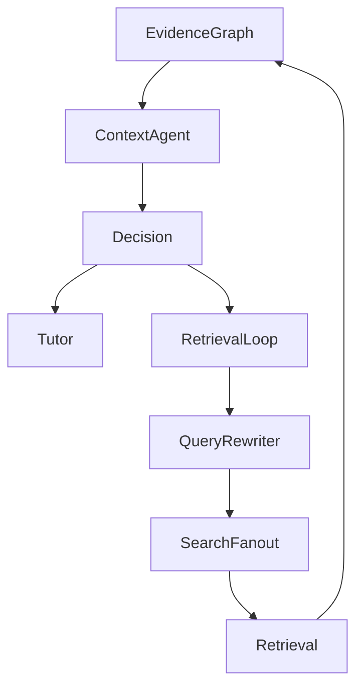
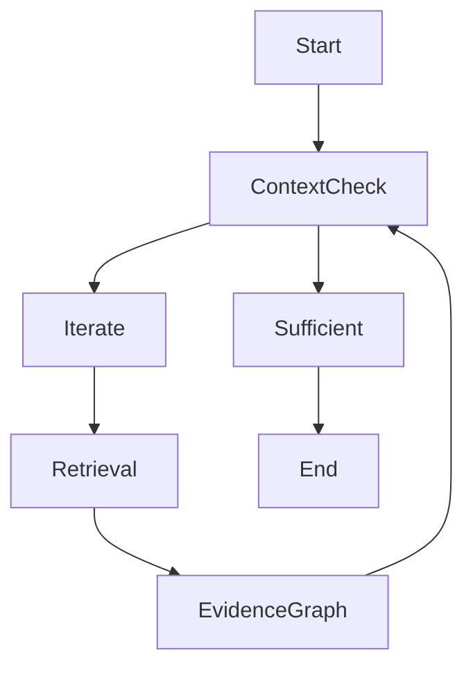
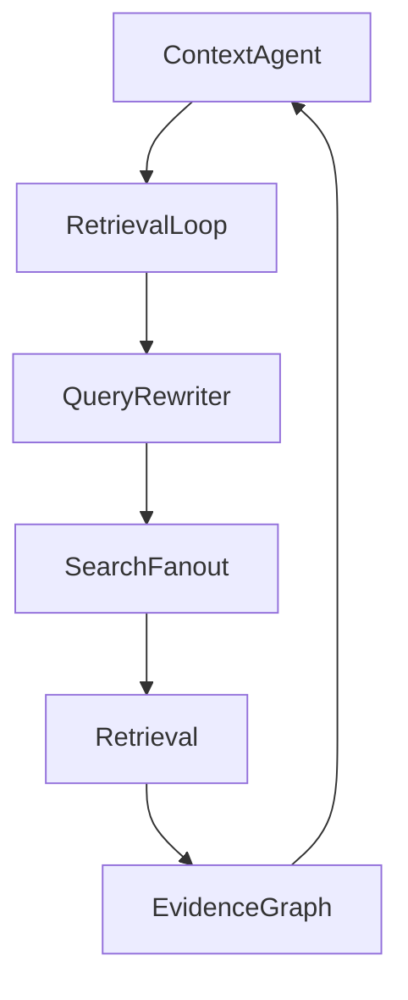

# PRD-007 — Iterative Retrieval Loop

## Project

EthioBio AI Assistant

## Initiative

Google-Style Multi-Agent Agentic RAG

## Component

Iterative Retrieval Loop

## Priority

CRITICAL

## Status

Planned

## Type

Core Orchestration Layer

---

# 1. Executive Summary

The Iterative Retrieval Loop is the orchestration mechanism that enables Agentic RAG behavior.

Without this component:

```text
Retrieve Once
↓
Generate Answer
```

With this component:

```text
Retrieve
↓
Evaluate Context
↓
Need More Information?
↓
Retrieve Again
↓
Evaluate Again
↓
Generate Answer
```

This PRD operationalizes the decision produced by the Sufficient Context Agent.

The loop continues retrieval until:

* sufficient evidence exists
* retrieval budget is exhausted
* stopping criteria are reached

This is the core behavior that distinguishes Google-style Agentic RAG from traditional RAG.

---

# 2. Problem Statement

Current retrieval systems behave as:

```text
Question
↓
Single Retrieval
↓
Answer
```

This assumes:

```text
First Retrieval = Best Retrieval
```

which is often false.

Example:

Question:

```text
Compare mitosis and meiosis,
identify my misconceptions,
and recommend a study plan.
```

First retrieval may return:

```text
✓ mitosis

✓ meiosis

✗ misconceptions

✗ study plan
```

Traditional RAG answers anyway.

Agentic RAG should:

```text
Retrieve Again
```

until missing evidence is found.

---

# 3. Goals

## Primary Goal

Implement an evidence-driven retrieval loop.

---

## Secondary Goals

Enable:

* iterative search
* retrieval correction
* evidence gap filling
* multi-hop retrieval
* dependable responses

---

# 4. Non-Goals

The Retrieval Loop does NOT:

* retrieve directly
* rewrite queries
* generate answers
* evaluate sufficiency

Those belong to other agents.

The loop only orchestrates.

---

# 5. Architecture



---

# 6. Core Responsibilities

The loop must:

### Execute Additional Retrieval

Based on:

```python
retrieval_feedback
```

---

### Track Iterations

Maintain:

```python
retrieval_iterations
```

---

### Prevent Infinite Loops

Enforce:

```python
max_iterations
```

---

### Track Retrieval Progress

Determine:

```python
coverage_improvement
```

between iterations.

---

### Stop When Appropriate

Exit when:

```python
sufficient == True
```

or budget exhausted.

---

# 7. State Contract

Input:

```python
state.requires_iteration

state.retrieval_feedback

state.retrieval_iterations

state.coverage_analysis

state.sufficiency_score
```

---

Output:

```python
state.retrieval_iterations

state.loop_status

state.coverage_progress

state.termination_reason
```

---

# 8. Loop State Model

Location:

```text
src/core/loops/models.py
```

---

## RetrievalLoopState

```python
class RetrievalLoopState:

    iteration_count: int

    max_iterations: int

    started_at: datetime

    coverage_history: list[float]

    sufficiency_history: list[float]

    terminated: bool

    termination_reason: str
```

---

# 9. Loop Lifecycle



---

# 10. Iteration Workflow

### Step 1

Receive feedback:

```python
[
    "retrieve_misconceptions",
    "retrieve_readiness"
]
```

---

### Step 2

Generate targeted retrieval tasks.

---

### Step 3

Execute retrieval.

---

### Step 4

Update Evidence Graph.

---

### Step 5

Re-evaluate sufficiency.

---

### Step 6

Repeat if necessary.

---

# 11. Retrieval Feedback Processing

Location:

```text
src/core/loops/feedback_processor.py
```

---

Example:

Input:

```python
[
    "retrieve_misconceptions"
]
```

Output:

```python
[
    RetrievalTask(
        source="memory",
        query="misconceptions meiosis"
    )
]
```

---

# 12. Coverage Progress Tracking

Track:

```python
coverage_score
```

over time.

---

Example:

| Iteration | Coverage |
| --------- | -------- |
| 1         | 0.58     |
| 2         | 0.79     |
| 3         | 0.92     |

---

Used for:

```text
loop optimization
```

and

```text
early stopping
```

---

# 13. Stopping Criteria

## Success

```python
sufficiency_score >= 0.90
```

Result:

```python
termination_reason = "SUFFICIENT_CONTEXT"
```

---

## Max Iterations

Default:

```python
max_iterations = 3
```

Result:

```python
termination_reason = "MAX_ITERATIONS"
```

---

## No Improvement

If:

```python
coverage_gain < 0.02
```

for:

```python
2 consecutive iterations
```

Stop.

Reason:

```python
NO_MEANINGFUL_PROGRESS
```

---

## Empty Retrieval

If retrieval returns:

```python
0 new evidence items
```

Stop.

Reason:

```python
NO_NEW_EVIDENCE
```

---

# 14. Adaptive Iteration Budget

The Planner may estimate:

```python
estimated_iterations
```

---

Examples:

Simple Question:

```python
1
```

---

Complex Question:

```python
3
```

---

Multi-hop Question:

```python
5
```

---

Loop respects:

```python
min(max_iterations, planner_budget)
```

---

# 15. Query Refinement Strategy

Each iteration should become more focused.

Example:

Iteration 1:

```text
genetics misconceptions
```

---

Iteration 2:

```text
dominant recessive misconceptions
```

---

Iteration 3:

```text
student confusion dominant recessive inheritance
```

---

This prevents redundant searches.

---

# 16. Loop Observability

Track:

```python
iteration_count

coverage_delta

retrieval_cost

latency

new_evidence_count
```

---

Location:

```text
src/core/loops/telemetry.py
```

---

# 17. LangGraph Integration

Node:

```python
RetrievalLoopNode
```

Location:

```text
src/graphs/nodes/retrieval_loop.py
```

---

Flow:



---

# 18. Loop Controller

Location:

```text
src/core/loops/controller.py
```

---

Responsibilities:

### Start Loop

### Manage State

### Track Budget

### Stop Loop

### Record Metrics

---

# 19. Failure Handling

If retrieval fails:

Retry:

```python
max_retries = 2
```

---

If all retries fail:

Continue with available evidence.

---

If Context Agent fails:

Fallback:

```python
termination_reason = "CONTEXT_EVALUATION_FAILURE"
```

and proceed to Tutor Agent.

---

# 20. Evaluation Metrics

## Coverage Improvement

Target:

```text
>20%
```

average improvement.

---

## Iteration Efficiency

Target:

```text
<3 iterations
```

average.

---

## Retrieval Yield

Measure:

```text
new evidence per iteration
```

---

## Hallucination Reduction

Target:

```text
50% reduction
```

vs current architecture.

---

# 21. Success Criteria

### Functional

Must:

* execute iterative retrieval
* track iterations
* process retrieval feedback
* stop correctly

---

### Quality

Target:

```text
Coverage Improvement >20%
```

---

### Efficiency

Target:

```text
Average Iterations <3
```

---

### Reliability

Target:

```text
Infinite Loop Incidents = 0
```

---

# 22. Deliverables

## New Files

```text
src/core/loops/

├── controller.py
├── feedback_processor.py
├── models.py
├── telemetry.py
├── evaluator.py
```

---

## Graph Node

```text
src/graphs/nodes/retrieval_loop.py
```

---

## Tests

```text
tests/loops/

├── test_controller.py
├── test_feedback_processor.py
├── test_termination.py
├── test_progress_tracking.py
```

---

# 23. Dependencies

Requires:

```text
PRD-001A Agent Runtime

PRD-001B Evidence Graph Foundation

PRD-002 Planner Agent

PRD-003 Query Rewriter Agent

PRD-004 Search Fanout Agent

PRD-005 Evidence Graph

PRD-006 Sufficient Context Agent
```

---

# 24. Outputs To Next Component

Produces:

```python
final_evidence_set

coverage_history

sufficiency_history

termination_reason
```

These outputs become the direct inputs for **PRD-008 — Tutor Synthesis Agent**, which is responsible for transforming verified, sufficient, and grounded evidence into educational responses while preserving traceability, personalization, and pedagogical quality.

---

## Important Architectural Observation

At this point (PRD-001A → PRD-007), EthioBio will have implemented nearly all of Google's Agentic Retrieval architecture:

| Capability             | Status |
| ---------------------- | ------ |
| Planning               | ✅      |
| Query Rewriting        | ✅      |
| Search Fanout          | ✅      |
| Multi-Source Retrieval | ✅      |
| Evidence Management    | ✅      |
| Coverage Analysis      | ✅      |
| Sufficiency Evaluation | ✅      |
| Iterative Retrieval    | ✅      |

The remaining major capabilities are:

1. **Grounded Response Synthesis** (PRD-008)
2. **Observability & Evaluation** (PRD-009)

These complete the transition from a retrieval-centric architecture into a dependable, production-grade Multi-Agent Agentic RAG platform.
