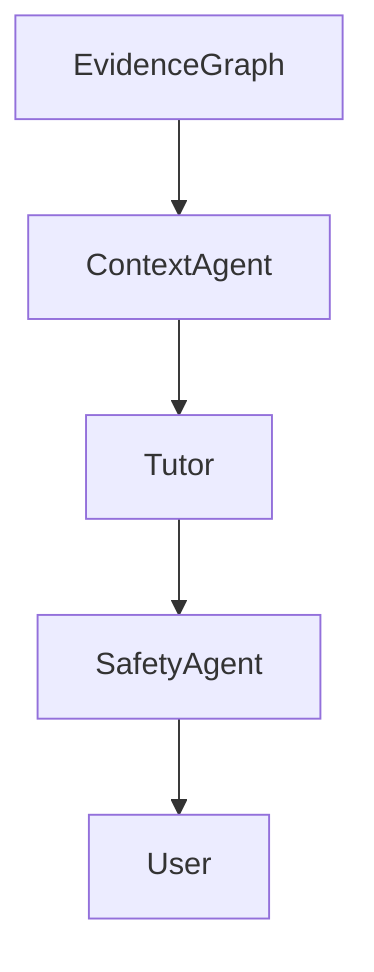
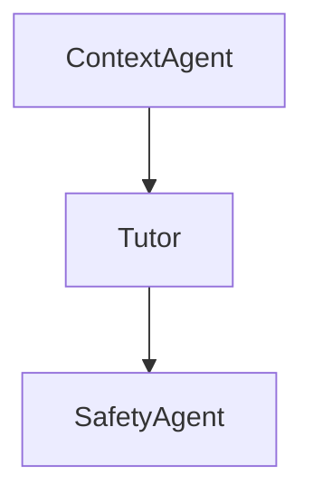

# PRD-008 — Tutor Synthesis Agent

## Project

EthioBio AI Assistant

## Initiative

Google-Style Multi-Agent Agentic RAG

## Component

Tutor Synthesis Agent

## Priority

CRITICAL

## Status

Planned

## Type

Core Educational Agent

---

# 1. Executive Summary

The Tutor Synthesis Agent is responsible for generating the final educational response.

Unlike traditional RAG systems, the Tutor Agent is not allowed to:

```text
Retrieve Information
Evaluate Sufficiency
Plan Searches
```

Its sole responsibility is:

```text
Convert Verified Evidence
+
Learner Context
+
Pedagogical Strategy

into

Grounded Educational Responses
```

This separation of responsibilities is a key principle of Agentic RAG.

The Tutor Agent should assume:

```text
Evidence Already Verified
```

because that work has already been completed by:

* Evidence Graph
* Sufficient Context Agent
* Retrieval Loop

---

# 2. Problem Statement

Current educational agents often perform:

```text
Retrieve
+
Reason
+
Teach
+
Verify
```

inside a single LLM call.

This creates:

* Hallucinations
* Weak grounding
* Poor personalization
* Inconsistent tutoring behavior

Google-style Agentic RAG separates:

```text
Retrieval Responsibility
```

from

```text
Teaching Responsibility
```

EthioBio should follow the same pattern.

---

# 3. Goals

## Primary Goal

Generate educational responses only from verified evidence.

---

## Secondary Goals

Support:

* Socratic tutoring
* Personalized instruction
* Misconception correction
* Adaptive explanations
* Learning recommendations
* Educational grounding

---

# 4. Non-Goals

Tutor Agent must NOT:

### Perform Retrieval

### Rewrite Queries

### Evaluate Sufficiency

### Decide Iterations

### Create Retrieval Plans

Those belong to previous agents.

---

# 5. Architecture



---

# 6. Core Responsibilities

The Tutor Agent must:

### Generate Answers

Based only on:

```python
verified_evidence
```

---

### Personalize Explanations

Using:

```python
learner_snapshot
```

---

### Correct Misconceptions

Using:

```python
misconceptions
```

---

### Apply Educational Strategy

Support:

```python
SOCRATIC

DIRECT_EXPLANATION

GUIDED_DISCOVERY

REMEDIATION

ASSESSMENT_PREP
```

---

### Produce Grounded Responses

Every major claim should map to evidence.

---

# 7. State Contract

Input:

```python
state.evidence_items

state.evidence_summary

state.coverage_analysis

state.learner_snapshot

state.learning_recommendations

state.misconceptions

state.sufficiency_score
```

---

Output:

```python
state.response_draft

state.grounded_response

state.citation_map
```

---

# 8. Tutor Response Model

Location:

```text
src/agents/tutor/models.py
```

---

## TutorResponse

```python
class TutorResponse:

    content: str

    confidence: float

    teaching_strategy: str

    evidence_used: list[str]

    misconceptions_addressed: list[str]

    recommendations: list[str]
```

---

# 9. Teaching Strategy Selection

Location:

```text
src/agents/tutor/strategy.py
```

---

## Fact Questions

Example:

```text
What is osmosis?
```

Strategy:

```python
DIRECT_EXPLANATION
```

---

## Conceptual Questions

Example:

```text
Why is meiosis important?
```

Strategy:

```python
GUIDED_DISCOVERY
```

---

## Learning Struggles

Example:

```text
Why do I struggle with genetics?
```

Strategy:

```python
REMEDIATION
```

---

## Practice Questions

Example:

```text
Quiz me on cell division.
```

Strategy:

```python
SOCRATIC
```

---

# 10. Grounding Requirements

Every response section must be linked to evidence.

---

## Example

Response:

```text
Meiosis produces genetically diverse cells.
```

Must map to:

```python
evidence_id = "bio_ch4_22"
```

---

Store:

```python
citation_map
```

---

Schema:

```python
class CitationMap:

    response_segment: str

    evidence_ids: list[str]
```

---

# 11. Hallucination Prevention

Tutor Agent may ONLY use:

```python
evidence_items
```

---

Forbidden:

```text
Adding unsupported facts

Inventing concepts

Guessing learner history
```

---

If evidence missing:

Respond:

```text
The available evidence does not fully answer that aspect of your question.
```

rather than inventing content.

---

# 12. Personalization Layer

Location:

```text
src/agents/tutor/personalization.py
```

---

Uses:

```python
learner_snapshot
```

---

Example:

Learner:

```python
{
  "readiness": "low",
  "grade_level": 8
}
```

Output:

```text
simplified explanation
```

---

Advanced Learner:

```python
{
  "readiness": "high"
}
```

Output:

```text
advanced explanation
```

---

# 13. Misconception Remediation

Input:

```python
misconceptions
```

Example:

```python
[
  "confuses dominant and recessive"
]
```

---

Tutor should:

```text
Identify misconception

Explain why incorrect

Provide corrected mental model
```

---

# 14. Recommendation Generation

Input:

```python
learning_recommendations
```

---

Output:

```text
Suggested study actions
```

---

Example:

```text
Review meiosis stages

Practice comparison questions

Complete quiz set B
```

---

# 15. Response Structure

Default format:

```text
Answer

Explanation

Misconception Correction

Personalized Guidance

Next Learning Steps
```

---

# 16. Tutor Prompt

Location:

```text
src/agents/tutor/prompts.py
```

---

System Prompt:

```text
You are the Tutor Synthesis Agent.

Your job is to teach using only verified evidence.

You must:

- remain grounded
- personalize explanations
- correct misconceptions
- recommend next steps

You must not:

- retrieve information
- invent facts
- answer unsupported questions
```

---

# 17. LangGraph Integration

Node:

```python
TutorNode
```

Location:

```text
src/graphs/nodes/tutor.py
```

---

Flow:



---

# 18. Educational Quality Metrics

Measure:

### Clarity

### Accuracy

### Grounding

### Personalization

### Misconception Resolution

---

Target:

```text
>90%
```

human evaluation score.

---

# 19. Evaluation Metrics

## Grounding Accuracy

Target:

```text
>95%
```

---

## Hallucination Rate

Target:

```text
<2%
```

---

## Personalization Accuracy

Target:

```text
>85%
```

---

## Educational Helpfulness

Target:

```text
>90%
```

---

# 20. Failure Handling

If evidence unavailable:

Return:

```text
Insufficient evidence available to provide a dependable answer.
```

---

If learner profile unavailable:

Fallback:

```python
DEFAULT_TUTOR_STRATEGY
```

---

If recommendations unavailable:

Continue response generation.

---

# 21. Success Criteria

### Functional

Must:

* Generate grounded responses
* Personalize explanations
* Correct misconceptions
* Use verified evidence only

---

### Quality

Target:

```text
Grounding Accuracy >95%
```

---

### Reliability

Target:

```text
Hallucination Rate <2%
```

---

# 22. Deliverables

## New Files

```text
src/agents/tutor/

├── tutor.py
├── prompts.py
├── strategy.py
├── personalization.py
├── grounding.py
├── models.py
├── evaluator.py
```

---

## Graph Node

```text
src/graphs/nodes/tutor.py
```

---

## Tests

```text
tests/tutor/

├── test_grounding.py
├── test_personalization.py
├── test_misconceptions.py
├── test_tutor.py
```

---

# 23. Dependencies

Requires:

```text
PRD-001A Agent Runtime

PRD-001B Evidence Graph

PRD-002 Planner Agent

PRD-003 Query Rewriter Agent

PRD-004 Search Fanout Agent

PRD-005 Evidence Graph

PRD-006 Sufficient Context Agent

PRD-007 Iterative Retrieval Loop
```

---

# 24. Outputs To Next Component

Produces:

```python
grounded_response

citation_map

teaching_strategy

response_confidence
```

These outputs feed into the final platform layer:

> **PRD-009 — Agentic RAG Observability, Evaluation & Governance Platform**

This final PRD is particularly important because Google's production Agentic RAG systems emphasize not only retrieval quality but also:

* traceability
* evaluation
* grounding verification
* agent monitoring
* governance
* safety
* continuous improvement

PRD-009 will transform EthioBio from a functional Agentic RAG implementation into a production-grade, enterprise-quality Multi-Agent Agentic RAG platform.
