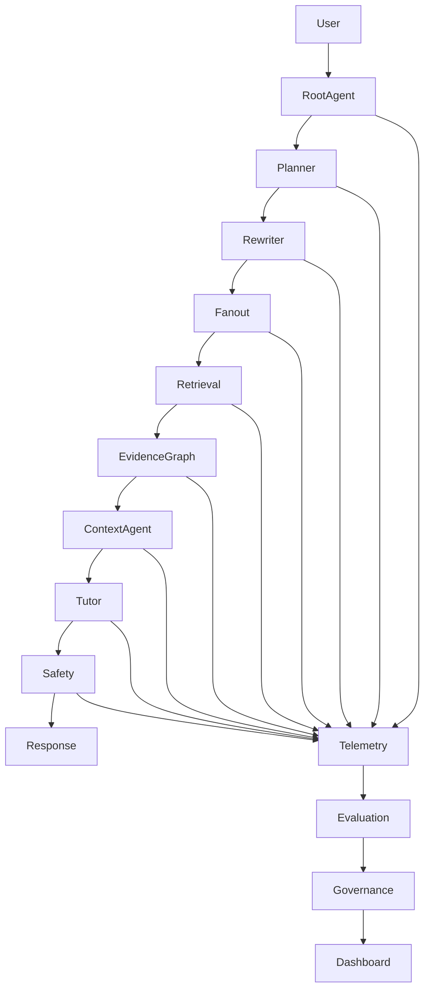

# PRD-009 — Agentic RAG Observability, Evaluation & Governance Platform

## Project

EthioBio AI Assistant

## Initiative

Google-Style Multi-Agent Agentic RAG

## Component

Observability, Evaluation & Governance Platform

## Priority

CRITICAL

## Status

Planned

## Type

Platform Infrastructure

---

# 1. Executive Summary

This PRD introduces the final layer required to transform EthioBio from a functional Agentic RAG system into a production-grade Multi-Agent Agentic RAG platform.

By PRD-008, the system can:

* Plan
* Rewrite queries
* Route retrieval
* Manage evidence
* Evaluate sufficiency
* Perform iterative retrieval
* Generate grounded responses

However, production systems require additional capabilities:

```text
Observe
Measure
Explain
Audit
Improve
```

Without this layer:

```text
System Works
```

With this layer:

```text
System Works
+
System Can Prove It Works
```

This PRD establishes:

* Agent tracing
* Evaluation pipelines
* Hallucination monitoring
* Retrieval analytics
* Governance controls
* Safety auditing
* Experimentation framework
* Continuous improvement loops

---

# 2. Problem Statement

Most RAG systems fail because teams cannot answer:

```text
Why did the answer fail?

Which agent caused failure?

Was retrieval sufficient?

What evidence was used?

Was personalization correct?

Did hallucination occur?
```

Google-style Agentic RAG requires:

```text
Full Traceability
```

across every decision.

---

# 3. Goals

## Primary Goal

Create complete observability and evaluation across all Agentic RAG components.

---

## Secondary Goals

Enable:

* Root-cause analysis
* Quality monitoring
* Agent benchmarking
* Retrieval diagnostics
* Safety auditing
* Governance enforcement
* Continuous optimization

---

# 4. Non-Goals

This platform does NOT:

* Generate answers
* Retrieve documents
* Execute tutoring

It measures and governs existing agents.

---

# 5. Architecture



---

# 6. Core Platform Components

## Component 1

Agent Telemetry

---

## Component 2

Evaluation Engine

---

## Component 3

Grounding Verification

---

## Component 4

Experimentation Framework

---

## Component 5

Governance Layer

---

## Component 6

Quality Dashboard

---

# 7. Agent Trace Framework

Location:

```text
src/observability/tracing/
```

---

Every agent execution must generate:

```python
AgentTrace
```

Schema:

```python
class AgentTrace:

    trace_id: str

    request_id: str

    agent_name: str

    start_time: datetime

    end_time: datetime

    duration_ms: float

    input_summary: dict

    output_summary: dict

    success: bool

    errors: list[str]
```

---

# 8. Request Trace Model

Location:

```text
src/observability/models.py
```

---

## RequestTrace

```python
class RequestTrace:

    request_id: str

    user_query: str

    execution_path: list[str]

    total_latency_ms: float

    retrieval_iterations: int

    final_confidence: float
```

---

# 9. Retrieval Analytics

Track:

### Query Rewrites

### Retrieval Sources

### Recall

### Precision

### Evidence Counts

### Iteration Counts

---

Schema:

```python
class RetrievalMetrics:

    retrieval_count: int

    evidence_count: int

    source_count: int

    coverage_score: float

    sufficiency_score: float
```

---

# 10. Evidence Attribution Framework

Every response must support:

```text
Why was this answer generated?
```

---

Store:

```python
class AttributionRecord:

    response_segment: str

    evidence_ids: list[str]

    source_names: list[str]
```

---

Required for:

* audits
* debugging
* trust

---

# 11. Hallucination Detection System

Location:

```text
src/evaluation/hallucination/
```

---

Evaluate:

```text
Response Claim
↓
Evidence Support
↓
Supported?
```

---

Output:

```python
class HallucinationAssessment:

    supported_claims: int

    unsupported_claims: int

    hallucination_rate: float
```

---

# 12. Grounding Verification Engine

Location:

```text
src/evaluation/grounding/
```

---

Verify:

```text
Claim
↓
Evidence
↓
Support Score
```

---

Output:

```python
class GroundingAssessment:

    grounding_score: float

    unsupported_segments: list[str]
```

---

# 13. Agent Evaluation Framework

Every agent receives independent metrics.

---

## Planner Agent

Measure:

```text
Task Coverage Accuracy

Domain Selection Accuracy

Plan Quality
```

---

## Query Rewriter

Measure:

```text
Coverage

Recall Improvement

Redundancy
```

---

## Search Fanout

Measure:

```text
Routing Accuracy

Latency

Source Selection Accuracy
```

---

## Evidence Graph

Measure:

```text
Deduplication

Coverage Detection

Missing Information Accuracy
```

---

## Context Agent

Measure:

```text
Sufficiency Accuracy

Premature Answer Rate
```

---

## Tutor Agent

Measure:

```text
Grounding

Personalization

Misconception Resolution
```

---

# 14. Benchmark Dataset Framework

Location:

```text
evaluation/benchmarks/
```

---

Datasets:

## Biology

## Chemistry

## Physics

## Mathematics

## Ethiopian Curriculum

## Personalized Learning

---

Schema:

```python
class BenchmarkCase:

    question: str

    expected_topics: list[str]

    expected_sources: list[str]

    expected_answer: str
```

---

# 15. Offline Evaluation Pipeline

Location:

```text
evaluation/pipelines/
```

---

Run:

```text
Benchmark
↓
Full Agent Workflow
↓
Score
↓
Report
```

---

Output:

```python
EvaluationReport
```

---

# 16. Online Evaluation Framework

Monitor live traffic.

Track:

```text
Latency

Grounding

Failures

Retrieval Quality

User Satisfaction
```

---

# 17. Experimentation Platform

Location:

```text
src/experiments/
```

---

Support:

## A/B Testing

Example:

```text
Current Rewriter

vs

New Rewriter
```

---

## Prompt Experiments

Example:

```text
Prompt V1

vs

Prompt V2
```

---

## Retrieval Experiments

Example:

```text
BM25

vs

Hybrid
```

---

# 18. Governance Framework

Location:

```text
src/governance/
```

---

Policies:

### Safety

### Educational Compliance

### Source Validation

### Privacy Rules

### Memory Access Rules

---

# 19. Educational Governance

Special EthioBio requirement.

Verify:

```text
Grade Appropriateness

Curriculum Alignment

Age Appropriateness

Pedagogical Compliance
```

---

# 20. Quality Dashboard

Location:

```text
dashboard/
```

---

Display:

### Request Volume

### Agent Latency

### Retrieval Quality

### Hallucination Rate

### Grounding Score

### User Satisfaction

### Personalization Accuracy

---

# 21. LangSmith Integration

Recommended.

Integrate:

[LangSmith](https://smith.langchain.com?utm_source=chatgpt.com)

---

Track:

```text
Graph Execution

Agent Traces

Prompt Versions

Evaluation Runs
```

---

# 22. OpenTelemetry Integration

Recommended.

Integrate:

[OpenTelemetry](https://opentelemetry.io?utm_source=chatgpt.com)

---

Track:

```text
Latency

Spans

Distributed Traces

Failures
```

---

# 23. Evaluation Metrics

## Retrieval

| Metric            | Target |
| ----------------- | ------ |
| Recall@10         | >90%   |
| Precision@10      | >85%   |
| Coverage Accuracy | >85%   |

---

## Context Agent

| Metric                | Target |
| --------------------- | ------ |
| Sufficiency Accuracy  | >85%   |
| Premature Answer Rate | <5%    |

---

## Tutor

| Metric                   | Target |
| ------------------------ | ------ |
| Grounding Accuracy       | >95%   |
| Hallucination Rate       | <2%    |
| Personalization Accuracy | >85%   |

---

## System

| Metric             | Target |
| ------------------ | ------ |
| End-to-End Latency | <5s    |
| Success Rate       | >99%   |
| Agent Failures     | <1%    |

---

# 24. Success Criteria

The platform must answer:

```text
Why did this answer happen?
```

---

It must identify:

```text
Which evidence was used?
```

---

It must determine:

```text
Which agent failed?
```

---

It must measure:

```text
How grounded was the answer?
```

---

It must support:

```text
Continuous Improvement
```

without manual investigation.

---

# 25. Deliverables

## New Directories

```text
src/

├── observability/
├── evaluation/
├── governance/
├── experiments/
├── dashboards/
```

---

## Core Modules

```text
src/observability/

├── tracing/
├── metrics/
├── telemetry/
├── attribution/
```

---

```text
src/evaluation/

├── grounding/
├── hallucination/
├── benchmark/
├── pipelines/
```

---

```text
src/governance/

├── policies/
├── validators/
├── compliance/
```

---

## Tests

```text
tests/

├── observability/
├── evaluation/
├── governance/
```

---

# 26. Dependencies

Requires completion of:

```text
PRD-001A
PRD-001B

PRD-002 Planner Agent
PRD-003 Query Rewriter Agent
PRD-004 Search Fanout Agent
PRD-005 Evidence Graph
PRD-006 Sufficient Context Agent
PRD-007 Iterative Retrieval Loop
PRD-008 Tutor Synthesis Agent
```

---

# Final Architecture Outcome

After PRD-009, EthioBio evolves from:

```text
Advanced Educational RAG
```

to:

```text
Multi-Agent Educational Agentic RAG Platform
```

with:

✅ Planning Agents
✅ Query Rewriting Agents
✅ Search Fanout Agents
✅ Multi-Source Retrieval
✅ Evidence Graph
✅ Context Sufficiency Verification
✅ Iterative Retrieval Loops
✅ Grounded Tutor Synthesis
✅ Agent Observability
✅ Governance & Evaluation
✅ Continuous Improvement Infrastructure

This architecture is substantially aligned with the Agentic RAG principles described by [Google Research's Agentic RAG work](https://research.google/blog/unlocking-dependable-responses-with-gemini-enterprise-agent-platforms-agentic-rag/?utm_source=chatgpt.com) while preserving EthioBio's educational personalization, memory, and tutoring capabilities.
