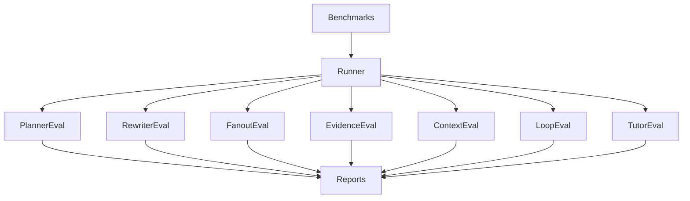

# PRD-010A — Agent Evaluation Framework

## Project

EthioBio AI Assistant

## Initiative

Google-Style Multi-Agent Agentic RAG

## Component

Agent Evaluation Framework

## Priority

CRITICAL

## Status

Planned

## Type

Validation / Quality Assurance Infrastructure

---

# 1. Executive Summary

This PRD introduces a dedicated evaluation framework to validate every agent in the Multi-Agent Agentic RAG architecture independently before system integration.

The objective is to prove:

* each agent performs its assigned responsibility,
* outputs remain correct,
* orchestration contracts are respected,
* regressions are automatically detected.

This PRD must be implemented before integration testing.

---

# 2. Objectives

Build an evaluation platform capable of:

1. Running isolated agent tests
2. Measuring agent quality
3. Tracking agent regressions
4. Producing machine-readable reports
5. Blocking merges when thresholds fail

---

# 3. Scope

Agents included:

```text
Planner Agent
Query Rewriter Agent
Search Fanout Agent
Evidence Graph
Sufficient Context Agent
Retrieval Loop
Tutor Agent
```

Excluded:

```text
Cross-system integration
Production load testing
UI testing
Educational benchmarking
```

Those belong to later PRDs.

---

# 4. Architecture



---

# 5. Directory Structure

```text
evaluation/

├── agents/
│
├── benchmarks/
│
├── scorers/
│
├── reports/
│
├── runners/
│
├── datasets/
│
└── regression/
```

---

# 6. Core Components

## Agent Runner

Location:

```text
evaluation/runners/agent_runner.py
```

Responsibilities:

* load benchmark
* execute agent
* collect outputs
* score outputs
* generate reports

---

## Scoring Engine

Location:

```text
evaluation/scorers/
```

Responsibilities:

* compute metrics
* normalize scores
* aggregate results

---

## Report Generator

Location:

```text
evaluation/reports/
```

Generate:

```json
{
  "agent": "planner",
  "score": 0.93,
  "pass": true
}
```

---

# 7. Benchmark Schema

Location:

```text
evaluation/datasets/schema.py
```

```python
class AgentBenchmark:

    id: str

    agent: str

    input_state: dict

    expected_output: dict

    expected_metrics: dict
```

---

# 8. Planner Agent Evaluation

Location:

```text
evaluation/agents/planner/
```

Validate:

* decomposition
* routing
* complexity estimation

Metrics:

| Metric           | Target |
| ---------------- | ------ |
| Plan Accuracy    | >90%   |
| Domain Selection | >95%   |
| Missing Tasks    | <5%    |

Example:

Input:

```json
{
  "question":"Compare mitosis and meiosis"
}
```

Expected:

```json
[
 "retrieve_mitosis",
 "retrieve_meiosis",
 "compare"
]
```

---

# 9. Query Rewriter Evaluation

Location:

```text
evaluation/agents/query_rewriter/
```

Validate:

* semantic expansion
* retrieval improvement
* diversity

Metrics:

| Metric             | Target  |
| ------------------ | ------- |
| Recall Improvement | >20%    |
| Query Diversity    | 0.6–0.8 |
| Redundancy         | <10%    |

---

# 10. Search Fanout Evaluation

Location:

```text
evaluation/agents/search_fanout/
```

Validate:

* routing
* source selection

Metrics:

| Metric          | Target |
| --------------- | ------ |
| Source Accuracy | >95%   |
| Latency         | <500ms |

---

# 11. Evidence Graph Evaluation

Location:

```text
evaluation/agents/evidence_graph/
```

Validate:

* deduplication
* evidence merging
* coverage

Metrics:

| Metric                  | Target |
| ----------------------- | ------ |
| Dedup Accuracy          | >95%   |
| Coverage Accuracy       | >85%   |
| Missing Topic Detection | >80%   |

---

# 12. Context Agent Evaluation

Location:

```text
evaluation/agents/context/
```

Validate:

* sufficiency decisions
* continuation decisions

Metrics:

| Metric                | Target |
| --------------------- | ------ |
| Sufficiency Accuracy  | >85%   |
| Premature Answer Rate | <5%    |
| False Retrieval Rate  | <10%   |

---

# 13. Retrieval Loop Evaluation

Location:

```text
evaluation/agents/retrieval_loop/
```

Validate:

* loop execution
* stopping logic
* iteration quality

Metrics:

| Metric         | Target |
| -------------- | ------ |
| Loop Success   | 100%   |
| Infinite Loops | 0      |
| Coverage Gain  | >20%   |

---

# 14. Tutor Agent Evaluation

Location:

```text
evaluation/agents/tutor/
```

Validate:

* grounding
* personalization
* remediation

Metrics:

| Metric          | Target |
| --------------- | ------ |
| Grounding       | >95%   |
| Hallucination   | <2%    |
| Personalization | >85%   |

---

# 15. Shared Evaluation State

Location:

```text
evaluation/models.py
```

```python
class EvaluationResult:

    score: float

    pass_status: bool

    latency_ms: float

    failures: list
```

---

# 16. Regression Framework

Location:

```text
evaluation/regression/
```

Capabilities:

* compare commits
* compare branches
* compare releases

Store:

```text
baseline_scores.json
```

Fail if:

```text
score_drop > 5%
```

---

# 17. Automated Runner

Location:

```text
evaluation/run_all.py
```

CLI:

```bash
python evaluation/run_all.py
```

Commands:

```bash
--planner

--rewriter

--fanout

--context

--loop

--tutor

--all
```

---

# 18. Reporting

Generate:

```text
evaluation/reports/

planner.json
rewriter.json
fanout.json
context.json
loop.json
tutor.json
summary.json
```

Dashboard:

```text
PASS

FAIL

REGRESSION

QUALITY SCORE
```

---

# 19. CI/CD Integration

Every PR executes:

```text
Agent Tests

Regression Tests

Threshold Validation
```

Fail build if:

```text
Planner <90

Context <85

Tutor <95

Loop Failure >0
```

---

# 20. Success Criteria

Agent certification requires:

| Agent    | Required Score |
| -------- | -------------- |
| Planner  | >90            |
| Rewriter | >85            |
| Fanout   | >95            |
| Evidence | >85            |
| Context  | >85            |
| Loop     | >95            |
| Tutor    | >95            |

Overall:

```text
Agent Score ≥ 90
```

---

# 21. Deliverables

Create:

```text
evaluation/

agents/
benchmarks/
datasets/
reports/
regression/
runners/
scorers/
```

Tests:

```text
tests/evaluation/
```

Outputs:

```text
summary.json

scorecard.json

certification.json
```

---

# 22. Exit Criteria

PRD-010A is complete only if:

* all agents execute independently
* evaluation reports generate
* regression suite passes
* CI blocks failed thresholds
* certification report produced

After completion:

Proceed to:

PRD-010B — Integration & System Compatibility Validation
