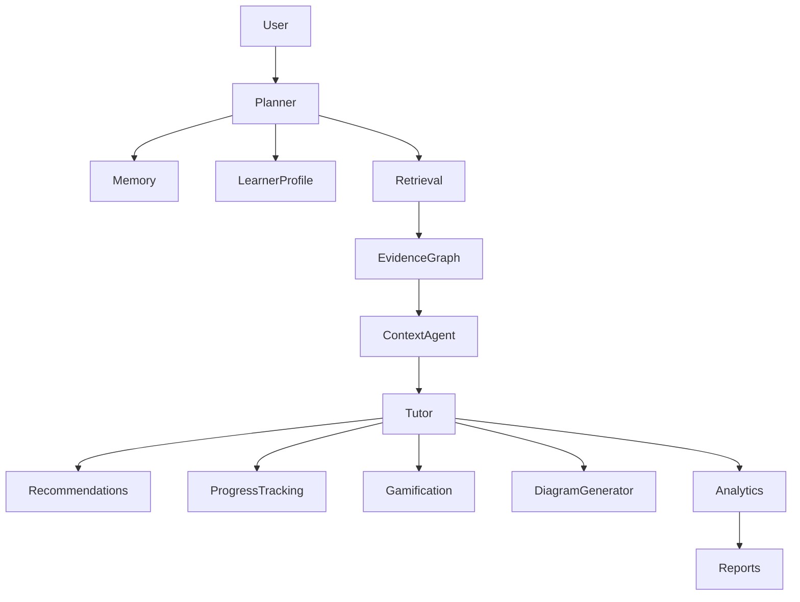

# PRD-010B — Integration & System Compatibility Validation

## Project

EthioBio AI Assistant

## Initiative

Google-Style Multi-Agent Agentic RAG

## Component

Integration & System Compatibility Validation Framework

## Priority

CRITICAL

## Status

Planned

## Type

System Validation / Integration Assurance

---

# 1. Executive Summary

This PRD validates that the newly implemented Multi-Agent Agentic RAG architecture integrates correctly with all existing EthioBio platform features.

Passing agent-level evaluations does not guarantee successful platform integration.

The objective of this PRD is to verify:

* agent interoperability
* feature compatibility
* state consistency
* cross-service communication
* end-to-end learner workflows
* backward compatibility

This PRD serves as the primary safeguard against integration regressions.

---

# 2. Objectives

Validate that the Multi-Agent Agentic RAG architecture works seamlessly with:

* Memory System
* Learner Profile System
* Assessment Engine
* Recommendation Engine
* Progress Tracking
* Gamification
* Study Plans
* Analytics
* Diagram Generation
* Knowledge Base
* Session Management

---

# 3. Success Definition

The architecture is considered integrated only when:

```text
All platform features operate correctly.

No state corruption occurs.

No feature regressions occur.

All learner journeys execute successfully.
```

---

# 4. Architecture



---

# 5. Validation Categories

## Category 1

Feature Compatibility

---

## Category 2

State Consistency

---

## Category 3

Workflow Integration

---

## Category 4

End-to-End Journeys

---

## Category 5

Regression Validation

---

# 6. Directory Structure

```text
tests/

├── integration/
│
├── workflows/
│
├── journeys/
│
├── contracts/
│
└── regression/
```

---

# 7. Integration Matrix

Location:

```text
evaluation/integration_matrix.py
```

---

Schema:

```python
INTEGRATION_MATRIX = {

    "planner": [
        "memory",
        "learner_profile",
        "knowledge_base"
    ],

    "query_rewriter": [
        "retrieval"
    ],

    "search_fanout": [
        "knowledge_sources"
    ],

    "evidence_graph": [
        "memory",
        "analytics"
    ],

    "context_agent": [
        "evidence_graph",
        "learner_profile"
    ],

    "tutor": [
        "recommendations",
        "progress_tracking",
        "gamification",
        "diagram_generation"
    ]
}
```

---

# 8. Memory Integration Validation

Location:

```text
tests/integration/memory/
```

---

Validate:

```text
Memory Retrieval

Memory Usage

Memory Updates

Memory Persistence

Memory Grounding
```

---

Test Example

```python
user_memory = {
    "weakness": "genetics"
}

question = "Help me improve biology."

response = agent.run(question)

assert "genetics" in response
```

---

Metrics

| Metric              | Target |
| ------------------- | ------ |
| Retrieval Accuracy  | >95%   |
| Memory Utilization  | >90%   |
| Persistence Success | 100%   |

---

# 9. Learner Profile Validation

Location:

```text
tests/integration/learner_profiles/
```

---

Validate:

```text
Readiness Levels

Grade Levels

Difficulty Adaptation

Learning Preferences
```

---

Example

```python
profile = {
    "grade": 8,
    "readiness": "low"
}
```

Expected:

```text
Simplified tutoring response
```

---

Metrics

| Metric              | Target |
| ------------------- | ------ |
| Adaptation Accuracy | >85%   |

---

# 10. Assessment Engine Integration

Location:

```text
tests/integration/assessments/
```

---

Validate:

```text
Assessment Results

Memory Updates

Learner Model Updates

Recommendation Updates
```

---

Workflow

```text
Assessment

↓

Incorrect Answer

↓

Misconception Stored

↓

Question Asked

↓

Misconception Retrieved

↓

Tutor Uses It
```

---

Metrics

| Metric             | Target |
| ------------------ | ------ |
| Update Success     | 100%   |
| Retrieval Accuracy | >90%   |

---

# 11. Recommendation Engine Validation

Location:

```text
tests/integration/recommendations/
```

---

Validate:

```text
Recommendation Creation

Recommendation Retrieval

Recommendation Utilization
```

---

Metrics

| Metric               | Target |
| -------------------- | ------ |
| Recommendation Usage | >85%   |

---

# 12. Progress Tracking Validation

Location:

```text
tests/integration/progress_tracking/
```

---

Validate:

```text
Learning Events

Progress Updates

Mastery Updates
```

---

Workflow

```text
Question

↓

Tutor Response

↓

Learning Event

↓

Progress Updated
```

---

Metrics

| Metric          | Target |
| --------------- | ------ |
| Update Accuracy | 100%   |

---

# 13. Gamification Validation

Location:

```text
tests/integration/gamification/
```

---

Validate:

```text
XP Awarding

Achievement Updates

Learning Streaks
```

---

Workflow

```text
Session Complete

↓

XP Awarded

↓

Achievement Updated
```

---

Metrics

| Metric              | Target |
| ------------------- | ------ |
| XP Success          | 100%   |
| Achievement Success | 100%   |

---

# 14. Diagram Generation Validation

Location:

```text
tests/integration/diagram_generation/
```

---

Validate:

```text
Diagram Request

Diagram Generation

Diagram Delivery

Tutor Integration
```

---

Workflow

```text
Question Requires Diagram

↓

Diagram Agent

↓

Diagram Returned

↓

Tutor Uses Result
```

---

Metrics

| Metric             | Target |
| ------------------ | ------ |
| Generation Success | >95%   |

---

# 15. Knowledge Base Integration

Location:

```text
tests/integration/knowledge_base/
```

---

Validate:

```text
Retrieval

Evidence Graph Ingestion

Grounding
```

---

Metrics

| Metric              | Target |
| ------------------- | ------ |
| Knowledge Retrieval | >90%   |

---

# 16. Session Management Validation

Location:

```text
tests/integration/session_management/
```

---

Validate:

```text
Session State

Conversation Continuity

Agent State Persistence
```

---

Metrics

| Metric             | Target |
| ------------------ | ------ |
| State Preservation | >99%   |

---

# 17. State Consistency Validation

Location:

```text
tests/workflows/state_consistency/
```

---

Verify:

```python
AgentState

MemoryState

ProgressState

LearnerState

RecommendationState
```

remain synchronized.

---

Metrics

| Metric      | Target |
| ----------- | ------ |
| Consistency | >99%   |

---

# 18. Contract Testing

Location:

```text
tests/contracts/
```

---

Validate service boundaries.

Example:

```python
result = memory.search()

assert result.schema == MemorySearchResult
```

---

Validate:

```text
Memory Contracts

Recommendation Contracts

Assessment Contracts

Progress Contracts

Analytics Contracts
```

---

# 19. End-to-End Journey Tests

Location:

```text
tests/journeys/
```

---

## Journey 1

Weak Genetics Student

Workflow:

```text
Assessment Failure

↓

Memory Update

↓

Question

↓

Retrieval

↓

Tutor

↓

Recommendations

↓

Progress Update

↓

XP Award
```

---

Assertions

```python
assert memory_used

assert personalization_used

assert recommendation_generated

assert progress_updated

assert xp_awarded
```

---

## Journey 2

Misconception Correction

Workflow:

```text
Assessment

↓

Incorrect Answer

↓

Misconception Stored

↓

Question

↓

Retrieval

↓

Correction
```

---

Assertions

```python
assert misconception_retrieved

assert misconception_addressed
```

---

## Journey 3

Personalized Study Planning

Workflow:

```text
Weak Topic

↓

Memory

↓

Recommendation

↓

Study Plan

↓

Progress Tracking
```

---

Assertions

```python
assert study_plan_generated

assert recommendation_used
```

---

# 20. Regression Validation

Location:

```text
tests/regression/
```

---

Compare:

```text
Current Release

vs

Previous Release
```

---

Detect:

```text
Broken Integrations

Missing Features

State Regressions
```

---

Fail if:

```text
Any feature regression detected
```

---

# 21. Automated Integration Runner

Location:

```text
evaluation/run_integration_tests.py
```

---

CLI

```bash
python evaluation/run_integration_tests.py
```

---

Supported Flags

```bash
--memory

--profiles

--recommendations

--progress

--gamification

--journeys

--all
```

---

# 22. Reporting

Generate:

```text
evaluation/reports/

integration_summary.json

feature_compatibility.json

journey_results.json

state_consistency.json
```

---

Example

```json
{
  "memory": "PASS",
  "recommendations": "PASS",
  "gamification": "PASS",
  "journeys": "PASS",
  "overall_score": 0.94
}
```

---

# 23. CI/CD Integration

Every PR executes:

```text
Feature Compatibility Tests

Journey Tests

State Validation Tests

Regression Tests
```

---

Fail Build If:

```text
Any Integration Test Fails

State Consistency <99%

Journey Success <95%
```

---

# 24. Success Criteria

Minimum Targets:

| Category           | Target |
| ------------------ | ------ |
| Memory             | >95%   |
| Profiles           | >85%   |
| Recommendations    | >85%   |
| Progress Tracking  | 100%   |
| Gamification       | 100%   |
| Diagram Generation | >95%   |
| State Consistency  | >99%   |
| Journey Success    | >95%   |

---

# 25. Deliverables

Create:

```text
tests/

integration/
journeys/
workflows/
contracts/
regression/
```

Create:

```text
evaluation/

integration/
reports/
runners/
```

Outputs:

```text
integration_summary.json

journey_results.json

certification.json
```

---

# 26. Exit Criteria

PRD-010B is complete only if:

* all platform integrations pass
* all learner journeys pass
* no state corruption detected
* no regressions detected
* CI/CD gates operational

After completion:

Proceed to:

PRD-010C — Educational Benchmark & Regression Suite
