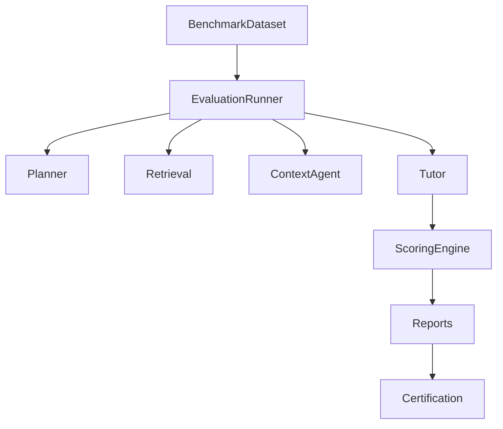

# PRD-010C — Educational Benchmark & Regression Suite

## Project

EthioBio AI Assistant

## Initiative

Google-Style Multi-Agent Agentic RAG

## Component

Educational Benchmark & Regression Framework

## Priority

CRITICAL

## Status

Planned

## Type

Educational Quality Assurance / Benchmarking Infrastructure

---

# 1. Executive Summary

This PRD establishes a comprehensive educational benchmark and regression testing framework to continuously evaluate educational quality across the EthioBio platform.

The framework will validate:

* Educational accuracy
* Curriculum alignment
* Personalization quality
* Misconception remediation
* Retrieval grounding
* Agent collaboration quality
* Learning effectiveness
* Release-to-release regressions

The benchmark suite becomes the authoritative source of truth for educational quality validation.

---

# 2. Objectives

Build a benchmark framework capable of:

1. Evaluating educational quality
2. Measuring learning effectiveness
3. Detecting regressions
4. Measuring personalization quality
5. Measuring grounding quality
6. Measuring curriculum coverage
7. Measuring multi-agent reasoning quality
8. Producing release certification reports

---

# 3. Success Definition

The educational system is considered benchmark-certified only when:

```text id="sdhdf9"
Educational accuracy exceeds targets

Grounding exceeds targets

Personalization exceeds targets

No benchmark regressions exist

Hallucination remains below threshold
```

---

# 4. Architecture



---

# 5. Directory Structure

```text
evaluation/

├── benchmarks/
│
├── datasets/
│
├── scorers/
│
├── regression/
│
├── reports/
│
└── certification/
```

---

# 6. Benchmark Categories

The benchmark suite must cover:

```text
Biology

Chemistry

Physics

Mathematics

Ethiopian Curriculum

Personalized Learning

Memory-Based Learning

Misconception Correction

Multi-Hop Reasoning

Study Recommendations

Diagram-Based Learning

Assessment-Driven Learning

Mixed Knowledge Retrieval
```

---

# 7. Dataset Structure

Location:

```text
evaluation/datasets/
```

---

Example:

```text
datasets/

biology/

chemistry/

physics/

mathematics/

curriculum/

memory/

personalization/

misconceptions/

multihop/

recommendations/

diagrams/
```

---

# 8. Benchmark Schema

Location:

```text
evaluation/datasets/schema.py
```

```python
class BenchmarkCase:

    id: str

    category: str

    question: str

    expected_topics: list[str]

    required_sources: list[str]

    required_agents: list[str]

    expected_answer_traits: list[str]

    expected_learning_outcome: str
```

---

# 9. Biology Benchmark Suite

Location:

```text
evaluation/benchmarks/biology/
```

---

Coverage:

```text
Cell Biology

Genetics

Evolution

Ecology

Human Biology

Plant Biology

Microbiology

Biochemistry
```

---

Metrics:

| Metric    | Target |
| --------- | ------ |
| Accuracy  | >90%   |
| Coverage  | >90%   |
| Grounding | >95%   |

---

# 10. Chemistry Benchmark Suite

Coverage:

```text
Atomic Structure

Chemical Reactions

Stoichiometry

Organic Chemistry

Acids and Bases

Thermodynamics
```

---

Metrics:

| Metric   | Target |
| -------- | ------ |
| Accuracy | >90%   |

---

# 11. Physics Benchmark Suite

Coverage:

```text
Mechanics

Electricity

Waves

Optics

Thermodynamics

Modern Physics
```

---

Metrics:

| Metric   | Target |
| -------- | ------ |
| Accuracy | >90%   |

---

# 12. Mathematics Benchmark Suite

Coverage:

```text
Algebra

Geometry

Trigonometry

Calculus

Statistics

Probability
```

---

Metrics:

| Metric   | Target |
| -------- | ------ |
| Accuracy | >90%   |

---

# 13. Ethiopian Curriculum Validation

Location:

```text
evaluation/benchmarks/curriculum/
```

---

Validate:

```text
Grade Alignment

Curriculum Alignment

Learning Objective Alignment

Topic Sequencing
```

---

Metrics:

| Metric             | Target |
| ------------------ | ------ |
| Alignment Accuracy | >90%   |

---

# 14. Personalization Benchmark

Location:

```text
evaluation/benchmarks/personalization/
```

---

Validate:

```text
Difficulty Adaptation

Grade Adaptation

Learning Style Adaptation

Knowledge Level Adaptation
```

---

Example:

```python
profile = {
    "grade": 8,
    "difficulty": "beginner"
}
```

Expected:

```text
Simplified educational response
```

---

Metrics:

| Metric                   | Target |
| ------------------------ | ------ |
| Personalization Accuracy | >85%   |

---

# 15. Memory-Based Learning Benchmark

Location:

```text
evaluation/benchmarks/memory/
```

---

Validate:

```text
Weakness Retrieval

History Retrieval

Preference Retrieval

Long-Term Context Usage
```

---

Metrics:

| Metric             | Target |
| ------------------ | ------ |
| Memory Utilization | >90%   |

---

# 16. Misconception Benchmark

Location:

```text
evaluation/benchmarks/misconceptions/
```

---

Validate:

```text
Misconception Detection

Misconception Retrieval

Misconception Correction
```

---

Metrics:

| Metric              | Target |
| ------------------- | ------ |
| Detection Accuracy  | >85%   |
| Correction Accuracy | >85%   |

---

# 17. Multi-Hop Reasoning Benchmark

Location:

```text
evaluation/benchmarks/multihop/
```

---

Validate:

```text
Cross-topic retrieval

Evidence synthesis

Multi-step reasoning
```

---

Metrics:

| Metric             | Target |
| ------------------ | ------ |
| Multi-Hop Accuracy | >85%   |

---

# 18. Diagram Learning Benchmark

Location:

```text
evaluation/benchmarks/diagrams/
```

---

Validate:

```text
Diagram Requests

Diagram Relevance

Diagram Integration

Diagram Learning Value
```

---

Metrics:

| Metric            | Target |
| ----------------- | ------ |
| Diagram Relevance | >85%   |

---

# 19. Grounding Evaluation

Location:

```text
evaluation/scorers/grounding.py
```

---

Validate:

```text
Evidence Usage

Source Attribution

Citation Accuracy

Hallucination Detection
```

---

Metrics:

| Metric             | Target |
| ------------------ | ------ |
| Grounding Accuracy | >95%   |
| Hallucination Rate | <2%    |

---

# 20. Educational Rubric Scoring

Location:

```text
evaluation/scorers/education.py
```

---

Dimensions:

| Dimension       | Weight |
| --------------- | ------ |
| Accuracy        | 30%    |
| Clarity         | 20%    |
| Relevance       | 20%    |
| Completeness    | 20%    |
| Personalization | 10%    |

---

Score:

```python
final_score = weighted_average(...)
```

---

Target:

```text
Educational Score >90
```

---

# 21. Learning Outcome Evaluation

Location:

```text
evaluation/scorers/learning_outcomes.py
```

---

Workflow:

```text
Question

↓

Tutor Session

↓

Assessment

↓

Learning Gain Measurement
```

---

Metrics:

| Metric        | Target |
| ------------- | ------ |
| Learning Gain | >20%   |

---

# 22. Regression Framework

Location:

```text
evaluation/regression/
```

---

Store:

```text
baseline_release/

previous_release/

current_release/
```

---

Compare:

```text
Accuracy

Grounding

Personalization

Learning Outcomes
```

---

Fail If:

```text
Score Drop >5%
```

---

# 23. Evaluation Runner

Location:

```text
evaluation/run_benchmarks.py
```

---

CLI

```bash
python evaluation/run_benchmarks.py
```

---

Flags

```bash
--biology

--chemistry

--physics

--math

--memory

--personalization

--misconceptions

--multihop

--all
```

---

# 24. Reporting

Location:

```text
evaluation/reports/
```

---

Generate:

```text
benchmark_summary.json

curriculum_report.json

grounding_report.json

learning_outcomes.json

regression_report.json
```

---

Example

```json
{
  "biology": 0.93,
  "chemistry": 0.91,
  "physics": 0.89,
  "personalization": 0.87,
  "grounding": 0.97,
  "overall_score": 0.92
}
```

---

# 25. Certification Engine

Location:

```text
evaluation/certification/
```

---

Generate:

```json
{
  "educational_score": 0.92,
  "grounding_score": 0.97,
  "personalization_score": 0.88,
  "hallucination_rate": 0.01,
  "certified": true
}
```

---

# 26. CI/CD Integration

Every PR executes:

```text
Benchmark Tests

Regression Tests

Grounding Tests

Personalization Tests

Curriculum Tests
```

---

Fail Build If:

```text
Educational Score <90

Grounding <95

Hallucination >2%

Regression >5%

Learning Gain <20%
```

---

# 27. Success Criteria

Minimum Targets:

| Category             | Target |
| -------------------- | ------ |
| Biology              | >90%   |
| Chemistry            | >90%   |
| Physics              | >90%   |
| Mathematics          | >90%   |
| Curriculum Alignment | >90%   |
| Personalization      | >85%   |
| Grounding            | >95%   |
| Hallucination        | <2%    |
| Learning Gain        | >20%   |

---

# 28. Deliverables

Create:

```text
evaluation/

benchmarks/
datasets/
scorers/
reports/
regression/
certification/
```

Create:

```text
tests/benchmarks/
```

Outputs:

```text
benchmark_summary.json

grounding_report.json

learning_outcomes.json

certification.json
```

---

# 29. Exit Criteria

PRD-010C is complete only if:

* benchmark suite implemented
* educational scoring operational
* regression detection operational
* certification engine operational
* CI/CD gates operational
* benchmark reports generated

After completion:

Proceed to:

PRD-010D — Production Readiness Certification Framework
