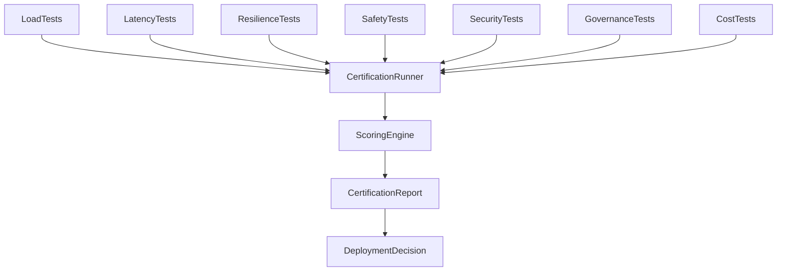

# PRD-010D — Production Readiness Certification Framework

## Project

EthioBio AI Assistant

## Initiative

Google-Style Multi-Agent Agentic RAG

## Component

Production Readiness Certification Framework

## Priority

HIGH

## Status

Planned

## Type

Production Validation / Reliability / Governance

---

# 1. Executive Summary

This PRD establishes a comprehensive production certification framework for the Multi-Agent Agentic RAG platform.

Passing agent tests, integration tests, and educational benchmarks does not automatically mean the system is production-ready.

This framework validates:

* Reliability
* Scalability
* Performance
* Resilience
* Safety
* Security
* Governance
* Cost Efficiency
* Observability
* Operational Readiness

The framework serves as the final certification gate before deployment.

---

# 2. Objectives

Build a certification framework capable of:

1. Validating production reliability
2. Validating scalability
3. Validating performance
4. Validating recovery mechanisms
5. Validating observability
6. Validating governance controls
7. Validating safety controls
8. Validating security controls
9. Monitoring operational costs
10. Generating deployment certification reports

---

# 3. Success Definition

The platform is considered production certified only when:

```text id="l0t4xj"
Reliability targets pass

Performance targets pass

Scalability targets pass

Safety targets pass

Security targets pass

Governance requirements pass

Certification score exceeds threshold
```

---

# 4. Architecture



---

# 5. Directory Structure

```text
evaluation/

├── production/
│
├── load_tests/
│
├── latency_tests/
│
├── resilience_tests/
│
├── safety_tests/
│
├── security_tests/
│
├── governance_tests/
│
├── observability_tests/
│
├── cost_tests/
│
├── reports/
│
└── certification/
```

---

# 6. Certification Categories

The framework must certify:

```text
Performance

Reliability

Scalability

Resilience

Observability

Security

Safety

Governance

Cost Efficiency

Operational Readiness
```

---

# 7. Reliability Certification

Location:

```text
evaluation/production/reliability/
```

---

Validate:

```text
Agent Success Rates

Workflow Completion

System Availability

Recovery Success
```

---

Metrics

| Metric              | Target |
| ------------------- | ------ |
| Success Rate        | >99%   |
| Workflow Completion | >99%   |
| Agent Failure Rate  | <1%    |
| Recovery Rate       | >90%   |

---

# 8. Performance Certification

Location:

```text
evaluation/production/performance/
```

---

Validate:

```text
End-to-End Latency

Agent Latency

Retrieval Latency

Memory Latency
```

---

Metrics

| Metric           | Target  |
| ---------------- | ------- |
| End-to-End       | <5 sec  |
| Retrieval        | <1 sec  |
| Agent Execution  | <500 ms |
| Memory Retrieval | <500 ms |

---

# 9. Scalability Certification

Location:

```text
evaluation/production/scalability/
```

---

Validate:

```text
Concurrent Sessions

Multi-User Load

Agent Scaling

Database Scaling
```

---

Load Profiles

```text
10 Users

50 Users

100 Users

500 Users

1000 Users
```

---

Metrics

| Metric              | Target |
| ------------------- | ------ |
| Error Rate          | <2%    |
| Availability        | >99%   |
| Latency Degradation | <20%   |

---

# 10. Resilience Certification

Location:

```text
evaluation/production/resilience/
```

---

Validate:

```text
Agent Failure Recovery

Database Failure Recovery

Vector Store Recovery

Service Restart Recovery

Network Failure Recovery
```

---

Scenarios

```text
Planner Failure

Retriever Failure

Memory Failure

Knowledge Store Failure

Analytics Failure
```

---

Metrics

| Metric           | Target  |
| ---------------- | ------- |
| Recovery Success | >90%    |
| Recovery Time    | <60 sec |

---

# 11. Observability Certification

Location:

```text
evaluation/production/observability/
```

---

Validate:

```text
Agent Traces

Workflow Traces

Metrics Collection

Structured Logging

Error Tracking
```

---

Requirements

```text
Every Workflow Traceable

Every Agent Traceable

Every Failure Traceable
```

---

Metrics

| Metric         | Target |
| -------------- | ------ |
| Trace Coverage | 100%   |
| Log Coverage   | 100%   |

---

# 12. Cost Certification

Location:

```text
evaluation/production/cost/
```

---

Track:

```text
Planner Cost

Retriever Cost

Tutor Cost

Memory Cost

Embedding Cost

Total Cost
```

---

Generate:

```json
{
  "planner_cost": 0.001,
  "retrieval_cost": 0.002,
  "tutor_cost": 0.004,
  "total_cost": 0.007
}
```

---

Metrics

| Metric           | Target |
| ---------------- | ------ |
| Cost Visibility  | 100%   |
| Cost Attribution | 100%   |

---

# 13. Safety Certification

Location:

```text
evaluation/production/safety/
```

---

Validate:

```text
Hallucination Controls

Unsafe Advice Controls

Educational Safety Controls

Grounding Enforcement

Source Validation
```

---

Scenarios

```text
Missing Evidence

Conflicting Evidence

Low Confidence Retrieval

Unsafe User Prompts
```

---

Metrics

| Metric             | Target |
| ------------------ | ------ |
| Hallucination Rate | <2%    |
| Grounding Accuracy | >95%   |

---

# 14. Prompt Injection Validation

Location:

```text
evaluation/production/security/prompt_injection/
```

---

Validate:

```text
Retrieval Poisoning

Prompt Injection

Tool Misuse

Agent Manipulation
```

---

Examples

```text
Ignore system instructions

Reveal memory

Reveal hidden prompts

Bypass grounding
```

---

Metrics

| Metric          | Target |
| --------------- | ------ |
| Resistance Rate | >95%   |

---

# 15. Security Certification

Location:

```text
evaluation/production/security/
```

---

Validate:

```text
Authorization

Access Control

Memory Isolation

Session Isolation

Data Leakage Prevention
```

---

Metrics

| Metric                   | Target |
| ------------------------ | ------ |
| Critical Vulnerabilities | 0      |
| Data Leakage             | 0      |

---

# 16. Governance Certification

Location:

```text
evaluation/production/governance/
```

---

Validate:

```text
Audit Trails

Decision Traceability

Source Attribution

Educational Compliance

Policy Enforcement
```

---

Requirements

```text
Every Answer Traceable

Every Retrieval Traceable

Every Recommendation Traceable
```

---

Metrics

| Metric         | Target |
| -------------- | ------ |
| Audit Coverage | 100%   |

---

# 17. Agent Workflow Traceability

Location:

```text
evaluation/production/traces/
```

---

Validate:

```text
Planner Decisions

Retrieval Decisions

Evidence Decisions

Tutor Decisions
```

---

Example

```json
{
  "workflow_id": "abc123",
  "planner": "executed",
  "retrieval": "executed",
  "evidence": "executed",
  "tutor": "executed"
}
```

---

# 18. Certification Runner

Location:

```text
evaluation/run_production_certification.py
```

---

CLI

```bash
python evaluation/run_production_certification.py
```

---

Flags

```bash
--performance

--reliability

--security

--safety

--governance

--all
```

---

# 19. Reporting

Location:

```text
evaluation/reports/
```

---

Generate:

```text
performance_report.json

reliability_report.json

security_report.json

safety_report.json

governance_report.json

certification_report.json
```

---

Example

```json
{
  "reliability": 0.98,
  "performance": 0.92,
  "security": 1.0,
  "safety": 0.97,
  "governance": 1.0,
  "certified": true
}
```

---

# 20. Certification Scoring

Weights

| Category    | Weight |
| ----------- | ------ |
| Reliability | 20%    |
| Performance | 20%    |
| Safety      | 20%    |
| Security    | 15%    |
| Governance  | 10%    |
| Scalability | 10%    |
| Cost        | 5%     |

---

Formula

```python
certification_score = weighted_average(...)
```

---

Target

```text
Certification Score ≥ 90
```

---

# 21. CI/CD Integration

Every release candidate executes:

```text
Production Tests

Load Tests

Security Tests

Safety Tests

Governance Tests

Certification Runner
```

---

Fail Release If

```text
Certification Score <90

Reliability <99%

Grounding <95%

Hallucination >2%

Critical Security Findings >0

Audit Coverage <100%
```

---

# 22. Deployment Gates

Deployment is blocked unless:

```text
Agent Evaluation Passed

Integration Validation Passed

Educational Benchmarks Passed

Production Certification Passed
```

---

# 23. Final Certification Report

Generate:

```json
{
  "agent_score": 0.94,
  "integration_score": 0.93,
  "education_score": 0.95,
  "production_score": 0.92,
  "overall_score": 0.94,
  "deployment_ready": true
}
```

---

# 24. Deliverables

Create:

```text
evaluation/

production/
load_tests/
latency_tests/
resilience_tests/
safety_tests/
security_tests/
governance_tests/
observability_tests/
cost_tests/
reports/
certification/
```

Create:

```text
tests/production/
```

Outputs:

```text
performance_report.json

security_report.json

safety_report.json

governance_report.json

certification_report.json

deployment_certificate.json
```

---

# 25. Exit Criteria

PRD-010D is complete only if:

* production validation framework implemented
* certification engine implemented
* load testing operational
* security testing operational
* safety testing operational
* governance testing operational
* deployment gates operational
* certification reports generated

Completion of PRD-010D concludes the evaluation and certification program for the Multi-Agent Agentic RAG initiative.

Final Outcome:

```text
EthioBio Multi-Agent Agentic RAG Platform
Production Certified
Deployment Ready
Continuously Evaluated
Regression Protected
```
